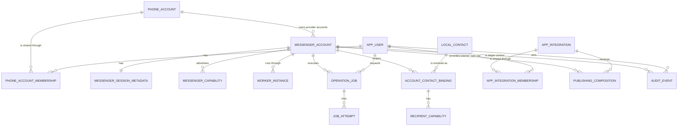

# گزارش فاز ۱: قرارداد معماری چندکاربره، چندحسابی و چندپیام‌رسانی

- تاریخ: ۲۰۲۶-۰۷-۳۱
- پروژه: `Eitaa_Bridge_MVP6_1_1_GMI4_2_RTL_Contacts_Quick_Send`
- خط مبنا: `a4df3ecf2bcd4ab658c5361afdc287444694fcd2`
- نسخه محصول: `0.7.0-ui-mvp6.1.1-gmi4.2`
- وضعیت این سند: تصمیم معماری لازم‌الاجرا برای فازهای بعد

## نتیجه اجرایی

فاز ۱ تکمیل شد. در این فاز قرارداد معماری آینده طراحی و ثبت شد و هیچ کد
اجرایی، Schema پایگاه داده، Session، داده کاربر یا تنظیم فعلی تغییر نکرد.
هیچ ورود، خروج، ارسال پیام، دعوت عضو، حذف عضو یا درخواست واقعی به ایتا و بله
انجام نشد.

مدل قطعی سامانه چنین است:

```text
AppUser
  └── PhoneAccountMembership
        └── PhoneAccount
              └── MessengerAccount
                    ├── Provider Worker
                    ├── Provider Session
                    └── Account-scoped Data
```

هر شماره تلفن فقط یک `PhoneAccount` در نصب محلی است. همان شماره می‌تواند یک
`MessengerAccount` ایتا و یک `MessengerAccount` بله داشته باشد. سشن، Worker،
محدودیت نرخ، Cache، Job و داده واقعی هر پیام‌رسان در سطح `MessengerAccount`
جدا می‌شوند.

افزودن بله مستلزم بازنویسی مدل مالکیت نخواهد بود. در آینده فقط Adapter و
Capabilityهای مستند و آزموده‌شده بله افزوده خواهند شد. در این سند هیچ API یا
قابلیت بله حدس زده نشده است.

زیرساخت دقیق لاگ نیز از این فاز یک الزام نسخه‌دار است. لاگ عملیاتی Coordinator،
لاگ هر Worker و Audit پایدار از هم جدا خواهند بود و هیچ دو Process در یک فایل
مشترک نمی‌نویسند.

## محدوده فاز ۱

موارد طراحی‌شده:

- مدل دامنه و رابطه‌های مالکیت
- شناسه‌ها، فیلدها، Unique Constraintها و قواعد حذف
- نقش‌های کاربر و عضویت حساب
- Scope اجباری برای API، Repository، Job و Worker
- قرارداد عمومی Provider و DTOهای امن
- Capability Registry و وضعیت قابلیت‌ها
- چرخه وضعیت حساب، احراز هویت و Worker
- مرز Process و قرارداد IPC
- API نسخه ۲ و سازگاری با API فعلی
- Feature Flag خاموش و Fail-closed
- Schema نسخه‌دار لاگ و سیاست Redaction
- Audit پایدار و زنجیره Correlation
- طرح مهاجرت و Rollback فاز ۲، بدون اجرای آن
- دروازه‌های آزمون و پذیرش فازهای بعد

موارد خارج از محدوده:

- ساخت یا Migration پایگاه داده
- انتقال Session یا فایل‌های فعلی
- ساخت Worker یا Coordinator واقعی
- تغییر مسیرهای فعلی برنامه
- احراز هویت واقعی AppUser
- اتصال واقعی به ایتا یا بله
- تعیین API و Capabilityهای بله
- فعال‌کردن معماری چندسشن
- تغییر رابط کاربری

## واژگان قطعی

### AppUser

کاربر خود نرم‌افزار است، نه کاربر ایتا یا بله. هویت، نقش عمومی و دسترسی او به
شماره‌ها در Coordinator مدیریت می‌شود.

### PhoneAccount

نماینده یک شماره تلفن نرمال‌شده است. شماره، مرز Session نیست و به‌تنهایی نشان
نمی‌دهد حساب متعلق به کدام پیام‌رسان است.

### PhoneAccountMembership

رابط دسترسی یک `AppUser` به یک `PhoneAccount` است. اگر دو کاربر نرم‌افزار به
یک شماره دسترسی داشته باشند، شماره تکثیر نمی‌شود؛ دو Membership ساخته می‌شود.

### MessengerAccount

حساب یک شماره در یک Provider مشخص است. نمونه‌ها:

```text
PhoneAccount(+98…1234) + eitaa = MessengerAccount A
PhoneAccount(+98…1234) + bale  = MessengerAccount B
```

این دو حساب Session، Worker، داده و محدودیت کاملاً مستقل دارند.

### Provider

پیاده‌سازی یک قرارداد عمومی برای یک پیام‌رسان است. `eitaa` و `bale` دو مقدار
Provider هستند. WordPress یک Integration مقصد است و Provider پیام‌رسان
محسوب نمی‌شود.

### Coordinator

مالک هویت کاربران، عضویت‌ها، فهرست حساب‌ها، Jobهای پایدار، Policy، Feature
Flag، Worker lifecycle و Audit است. Coordinator نباید Session Object، Auth
Key، Access Hash یا اتصال RPC را در حافظه یا پایگاه خود نگه دارد.

### Worker

یک Process مستقل که دقیقاً یک `MessengerAccount` را مالک است. فقط Worker
اجازه خواندن Session و داده Provider همان حساب را دارد.

## تصمیم‌های معماری

### ADR-01: شناسه داخلی به‌جای شماره تلفن

کلید اصلی همه موجودیت‌ها UUID نسخه ۴ با حروف کوچک و قالب canonical است.
شماره تلفن، نام کاربر، Provider ID یا مسیر فایل هرگز Primary Key یا نام مسیر
نیست.

دلایل:

- شماره داده شخصی است.
- قالب و کشور شماره ممکن است تغییر یا اصلاح شود.
- یک شماره در چند Provider تکرار می‌شود.
- درج شماره در URL، Path و Log خطر نشت ایجاد می‌کند.

### ADR-02: یکتایی PhoneAccount در هر نصب

یک شماره نرمال‌شده در هر نصب محلی فقط یک `PhoneAccount` دارد. یکتایی با
`phone_fingerprint` ساخته‌شده از HMAC-SHA-256 و Secret اختصاصی نصب کنترل
می‌شود. HMAC ساده SHA-256 نیست تا امکان جست‌وجوی فرهنگ‌لغتی شماره‌ها کاهش
یابد.

نسخه رمز‌شده شماره برای نیازهای ورود آینده نگه‌داری می‌شود. شماره plaintext
نباید در Coordinator DB، Log، URL، Path یا Audit ذخیره شود.

### ADR-03: دسترسی اشتراکی با Membership

اشتراک یک شماره میان کاربران نرم‌افزار با `PhoneAccountMembership` انجام
می‌شود، نه با تکرار PhoneAccount. دسترسی پیش‌فرض بسته است و فقط Membership
فعال یا نقش عمومی `admin` اجازه عبور می‌دهد.

استفاده مدیر از دسترسی عمومی باید با Audit و Reason ثبت شود.

### ADR-04: یک حساب فعال برای هر Provider در نسخه نخست

در نسخه نخست ترکیب زیر یکتا است:

```text
(phone_account_id, provider)
```

بنابراین یک شماره یک حساب ایتا و یک حساب بله دارد، ولی دو حساب هم‌زمان ایتا
برای همان شماره ندارد. اگر Provider در آینده مفهوم چندپروفایل برای یک شماره
داشت، این قید فقط با Migration و تصمیم معماری جدید تغییر می‌کند.

### ADR-05: یک Process برای هر MessengerAccount

هر Worker فقط یک حساب را باز می‌کند. Crash، Logout، Invalid Session،
Rate Limit یا بستن Core یک حساب نباید حساب دیگری را متوقف کند.

Shared Core سراسری فعلی نباید در Coordinator یا میان Workerها به اشتراک
گذاشته شود.

### ADR-06: Provider-neutral در بیرون، Provider-specific در Worker

Coordinator و UI فقط DTO و Capability عمومی می‌بینند. Peer ID، Access Hash،
RPC Object، Constructor، Session payload و پاسخ خام Provider از مرز Worker
عبور نمی‌کنند.

### ADR-07: وضعیت‌ها از هم جدا هستند

سه ستون وضعیت مستقل داریم:

1. وضعیت مدیریتی `MessengerAccount`
2. وضعیت احراز هویت و Session
3. وضعیت Process/Worker

`rate_limited` وضعیت موقت Worker است؛ حساب را Disabled یا Session را Invalid
نمی‌کند.

### ADR-08: Capability به‌جای شرط نام Provider

UI و Workflow نباید از شرط‌هایی مانند `provider == "eitaa"` برای نمایش یا
اجرای قابلیت استفاده کنند. تصمیم براساس Capability Snapshot همان حساب است.

### ADR-09: Feature Flag خاموش و Fail-closed

`multi_session.enabled` به‌صورت پیش‌فرض `false` است. نبودن، نامعتبر بودن یا
خوانده‌نشدن Flag معادل خاموش است. متغیر محیطی اضطراری فقط می‌تواند آن را
خاموش کند و حق روشن‌کردن آن را ندارد.

### ADR-10: لاگ عملیاتی و Audit دو محصول جدا هستند

لاگ عملیاتی برای تشخیص خطا و کارایی است و Rotation دارد. Audit برای ثبت
تغییرات حساس و انتساب عمل به Actor است و در Coordinator DB به‌صورت پایدار
نگه‌داری می‌شود. هیچ‌کدام مجاز به نگه‌داری Secret یا محتوای پیام نیستند.

## زمینه‌های مسئولیت

| زمینه | مالک | داده‌های اصلی |
|---|---|---|
| Identity & Access | Coordinator | AppUser، نقش، Membership |
| Account Registry | Coordinator | PhoneAccount، MessengerAccount، Capability snapshot |
| Provider Runtime | Worker | Session، اتصال، Peer resolution، Provider state |
| Local Contacts | Coordinator | نام، شماره رمز‌شده، دسته، Opt-out |
| Contact Binding | Coordinator + Worker | اتصال امن مخاطب محلی به حساب پیام‌رسان |
| Jobs | Coordinator | Job، Lease، Attempt، Idempotency، وضعیت |
| Publishing Integration | Coordinator | WordPress site access و composition scope |
| Observability | هر Process + Coordinator | Operational logs، Diagnostics، Audit |

## ERD منطقی



## قرارداد موجودیت‌ها

تمام Timestampها UTC و با دقت میلی‌ثانیه‌اند. همه جدول‌ها به‌جز Audit دارای
`created_at` و `updated_at` هستند. UUIDها در لایه Domain اعتبارسنجی می‌شوند.

### `app_users`

| فیلد | نوع | قاعده |
|---|---|---|
| `id` | UUID text | Primary Key |
| `display_name` | text | ۱ تا ۱۲۰ نویسه، فقط برای نمایش |
| `global_role` | enum | `admin` یا `user` |
| `status` | enum | `active`، `disabled`، `archived` |
| `auth_subject_fingerprint` | text nullable | Unique در صورت وجود؛ نه Username خام |
| `created_at` | UTC timestamp | اجباری |
| `updated_at` | UTC timestamp | اجباری |

احراز هویت AppUser در فاز دیگری پیاده می‌شود، ولی API نسخه ۲ بدون Principal
حل‌شده Server-side مجاز به کار نیست. Bearer Token فعلی API معادل AppUser
نیست.

### `phone_accounts`

| فیلد | نوع | قاعده |
|---|---|---|
| `id` | UUID text | Primary Key |
| `phone_ciphertext` | blob | شماره E.164 رمز‌شده |
| `phone_key_version` | integer | نسخه کلید رمز |
| `phone_fingerprint` | text | HMAC-SHA-256، Unique |
| `display_hint` | text nullable | فقط شکل ماسک‌شده؛ بدون شماره کامل |
| `status` | enum | `active`، `disabled`، `archived` |
| `created_at` | UTC timestamp | اجباری |
| `updated_at` | UTC timestamp | اجباری |

قواعد:

- ورودی ابتدا با Library معتبر شماره و Region صریح به E.164 تبدیل می‌شود.
- در صورت مبهم‌بودن Region، ثبت رد می‌شود؛ حدس از Locale سیستم ممنوع است.
- تغییر شماره، ایجاد PhoneAccount جدید و فرایند انتقال صریح است؛ Update ساده
  روی شماره موجود نیست.
- حذف فیزیکی تا زمانی که MessengerAccount یا Audit مرتبط وجود دارد ممنوع است.

### `phone_account_memberships`

| فیلد | نوع | قاعده |
|---|---|---|
| `id` | UUID text | Primary Key |
| `app_user_id` | UUID | Foreign Key |
| `phone_account_id` | UUID | Foreign Key |
| `role` | enum | `owner`، `operator`، `viewer` |
| `status` | enum | `active`، `revoked` |
| `created_by_app_user_id` | UUID | Actor ایجادکننده |
| `revoked_by_app_user_id` | UUID nullable | Actor لغوکننده |
| `created_at` | UTC timestamp | اجباری |
| `updated_at` | UTC timestamp | اجباری |

قیود:

- `UNIQUE(app_user_id, phone_account_id)`
- هر PhoneAccount غیرآرشیوی باید حداقل یک Owner فعال داشته باشد.
- آخرین Owner فقط در همان تراکنشی قابل حذف است که Owner جایگزین تعیین شود یا
  PhoneAccount آرشیو شود.
- تغییر Role و Revocation همیشه Audit می‌شود.

### `messenger_accounts`

| فیلد | نوع | قاعده |
|---|---|---|
| `id` | UUID text | Primary Key |
| `phone_account_id` | UUID | Foreign Key |
| `provider` | enum/registry key | ابتدا `eitaa`؛ `bale` فقط پس از Adapter معتبر |
| `label` | text nullable | نام محلی غیرحساس |
| `lifecycle_state` | enum | `created`، `active`، `paused`، `disabled`، `quarantined`، `archived` |
| `desired_worker_state` | enum | `running` یا `stopped` |
| `provider_subject_fingerprint` | text nullable | اثر انگشت هویت Provider، نه ID خام |
| `capability_revision` | integer | از صفر و صعودی |
| `created_at` | UTC timestamp | اجباری |
| `updated_at` | UTC timestamp | اجباری |

قیود:

- `UNIQUE(phone_account_id, provider)` در نسخه نخست
- در صورت وجود شناسه Provider:
  `UNIQUE(provider, provider_subject_fingerprint)`
- Provider پس از ساخت قابل تغییر نیست.
- PhoneAccount پس از ساخت قابل جابه‌جایی نیست.
- Archive عملیات صریح است و Session را خودکار حذف نمی‌کند.
- Session delete/logout عملیات جدا با تأیید و Audit است.

`provider_subject_fingerprint` با HMAC اختصاصی نصب ساخته می‌شود. Coordinator
نباید شناسه خام کاربر Provider را ذخیره کند.

### `messenger_session_metadata`

این جدول فقط Metadata غیرمحرمانه Session را دارد؛ خود Session فقط در فضای
خصوصی Worker است.

| فیلد | نوع | قاعده |
|---|---|---|
| `messenger_account_id` | UUID | Primary/Foreign Key |
| `auth_state` | enum | `absent`، `challenge_pending`، `authenticated`، `expired`، `revoked`، `invalid` |
| `session_generation` | integer | صعودی و غیرمنفی |
| `storage_revision` | integer | نسخه Layout حساب |
| `last_validated_at` | UTC timestamp nullable | بدون جزئیات حساس |
| `last_auth_transition_at` | UTC timestamp | اجباری |
| `safe_reason_code` | text nullable | کد کنترل‌شده، نه متن Exception |

در این جدول Token، Cookie، Phone Code، Phone Code Hash، Auth Key، Server
Salt، Session ID خام، Access Hash یا مسیر قابل‌انتخاب توسط کاربر وجود ندارد.

### `messenger_capabilities`

| فیلد | نوع | قاعده |
|---|---|---|
| `messenger_account_id` | UUID | Foreign Key |
| `capability` | stable enum | بخشی از Primary Key |
| `status` | enum | `supported`، `unsupported`، `unknown`، `restricted` |
| `reason_code` | text nullable | کد امن |
| `constraints_json` | JSON nullable | فقط Schema و Allowlist مشخص |
| `revision` | integer | با revision حساب منطبق |
| `observed_at` | UTC timestamp | اجباری |

Primary Key:

```text
(messenger_account_id, capability)
```

نبود رکورد معادل `unknown` است، نه `unsupported`.

### `worker_instances`

| فیلد | نوع | قاعده |
|---|---|---|
| `id` | UUID text | `worker_id` |
| `messenger_account_id` | UUID | Foreign Key |
| `generation` | integer | برای دفع Worker قدیمی |
| `runtime_state` | enum | `starting`، `ready`، `busy`، `rate_limited`، `stopping`، `stopped`، `crashed` |
| `process_id` | integer nullable | Telemetry محلی |
| `started_at` | UTC timestamp | اجباری |
| `last_heartbeat_at` | UTC timestamp nullable | اجباری پس از Ready |
| `retry_not_before` | UTC timestamp nullable | فقط Rate Limit |
| `stopped_at` | UTC timestamp nullable | در پایان |
| `exit_code` | integer nullable | در پایان |
| `safe_reason_code` | text nullable | کد کنترل‌شده |

در هر لحظه فقط یک Lease فعال برای یک `messenger_account_id` مجاز است. PID به
تنهایی اثبات مالکیت نیست؛ Lease generation و کانال IPC احرازشده نیز بررسی
می‌شوند.

### `local_contacts`

دفترچه محلی، دسته‌ها و Opt-out مشترک باقی می‌مانند. فیلدهای اختصاصی ایتا از
این موجودیت حذف می‌شوند.

اطلاعات مشترک:

- نام و نام خانوادگی
- نام سازمانی و توضیح محلی
- شماره رمز‌شده و Phone fingerprint
- دسته‌بندی‌ها
- Opt-out و علت آن
- Metadata ورود/ویرایش محلی

موارد ممنوع در `local_contacts`:

- `eitaa_user_id`
- `bale_user_id`
- Peer ID
- Access Hash
- Provider username
- Reachability یک حساب خاص

### `account_contact_bindings`

| فیلد | نوع | قاعده |
|---|---|---|
| `id` | UUID text | Primary Key |
| `messenger_account_id` | UUID | Foreign Key |
| `local_contact_id` | UUID | Foreign Key |
| `worker_binding_id` | UUID | مرجع opaque به داده Worker |
| `provider_subject_fingerprint` | text nullable | HMAC، نه ID خام |
| `reachability` | enum | `unknown`، `reachable`، `unreachable`، `blocked` |
| `last_resolved_at` | UTC timestamp nullable | Metadata امن |
| `safe_reason_code` | text nullable | کد کنترل‌شده |

قیود:

- `UNIQUE(messenger_account_id, local_contact_id)`
- در صورت وجود fingerprint:
  `UNIQUE(messenger_account_id, provider_subject_fingerprint)`
- `worker_binding_id` فقط در Worker همان حساب قابل Resolve است.
- Access Hash و Peer ID فقط در پایگاه خصوصی Worker باقی می‌مانند.

### `recipient_capabilities`

Capability گیرنده ممکن است از Capability کل حساب محدودتر باشد.

Primary Key:

```text
(account_contact_binding_id, capability)
```

فیلدها:

- `status`: `supported|unsupported|unknown|restricted`
- `safe_reason_code`
- `observed_at`
- `expires_at`

### `operation_jobs` و `job_attempts`

پیاده‌سازی کامل در فاز عملیاتی مربوط انجام می‌شود، ولی قرارداد Scope از اکنون
ثابت است.

هر Job شامل این موارد است:

- `job_id`
- `actor_app_user_id`
- `phone_account_id`
- `messenger_account_id`
- `provider`
- `operation`
- `status`
- `idempotency_key`
- `created_at`، `scheduled_at` و `completed_at`
- `lease_owner`، `lease_generation` و `lease_expires_at`
- `safe_payload_ref`
- `correlation_id`

قیود:

```text
UNIQUE(messenger_account_id, operation, idempotency_key)
```

Payload دارای پیام، Media یا داده حساس نباید در Coordinator Job JSON قرار
گیرد؛ محتوا در فضای خصوصی حساب یا Store رمز‌شده قرار می‌گیرد و Job فقط
Reference امن دارد.

هر Attempt دارای `attempt_id`، شماره Attempt، Worker generation، زمان شروع و
پایان، نتیجه، Error class/code و Retry-after است.

### WordPress و Integrationهای مقصد

WordPress Provider پیام‌رسان نیست. مدل آن به‌صورت `AppIntegration` باقی
می‌ماند و دسترسی به سایت با `AppIntegrationMembership` در سطح AppUser کنترل
می‌شود.

هر Composition باید این Scope را داشته باشد:

- `app_user_id`
- `source_messenger_account_id`
- `source_message_ref_hash`
- `target_integration_id`
- `composition_key`

کلید‌های فعلی `site_key::composition_key` و
`peer_type/peer_id/message_id` به‌تنهایی در معماری جدید کافی نیستند. وضعیت
«استفاده‌شده در WordPress» نباید میان دو کاربر یا دو MessengerAccount نشت
کند.

## مدل دسترسی

### نقش عمومی

| نقش | اختیار |
|---|---|
| `user` | فقط PhoneAccountهای دارای Membership فعال |
| `admin` | مدیریت نصب و دسترسی اضطراری به همه حساب‌ها با Audit اجباری |

### نقش Membership

| عملیات | viewer | operator | owner | admin |
|---|---:|---:|---:|---:|
| دیدن وضعیت و Capability | بله | بله | بله | بله |
| خواندن داده غیرحساس حساب | بله | بله | بله | بله |
| اجرای Send/Sync/Import | خیر | بله | بله | بله |
| Preview عملیات تغییردهنده | خیر | بله | بله | بله |
| ورود، Logout و تعویض Session | خیر | خیر | بله | بله |
| افزودن/لغو Membership | خیر | خیر | بله | بله |
| Disable/Archive حساب | خیر | خیر | بله | بله |
| تغییر Policy نصب | خیر | خیر | خیر | بله |

عملیات حساس حتی با Role مناسب باید Preview، تأیید صریح، Idempotency و Audit
داشته باشند.

## Context اجباری و جلوگیری از نشت

### `RequestContext`

در لبه API و فقط از اطلاعات Server-side ساخته می‌شود:

```text
actor_app_user_id
actor_global_role
request_id
correlation_id
causation_id
received_at
client_kind
```

`actor_app_user_id` از Body، Query یا Header انتخابی UI پذیرفته نمی‌شود.

### `AccountContext`

پس از حل شناسه حساب و کنترل دسترسی ساخته می‌شود:

```text
app_user_id
phone_account_id
membership_role
messenger_account_id
provider
request_id
correlation_id
causation_id
job_id
```

قواعد ساخت:

1. Principal فعال Server-side حل می‌شود.
2. `messenger_account_id` از Route خوانده می‌شود.
3. MessengerAccount از Coordinator DB خوانده می‌شود.
4. `phone_account_id` و `provider` از DB گرفته می‌شوند، نه از Client.
5. Membership فعال و Role لازم بررسی می‌شود.
6. وضعیت Account و Feature Flag بررسی می‌شود.
7. Context immutable ساخته و تا Worker منتقل می‌شود.

Mismatch در هر مرحله با خطای امن `account_scope_mismatch` یا
`account_access_denied` Fail-closed می‌شود.

### قاعده Repository

- Repository حساب‌محور متد بدون `AccountContext` ندارد.
- `messenger_account_id` پارامتر اختیاری نیست.
- Query حساب‌محور همیشه Scope را داخل همان SQL اعمال می‌کند.
- ابتدا خواندن و بعد فیلتر در حافظه ممنوع است.
- Repository مشترک، `AppUserScope` یا `SystemMaintenanceScope` صریح می‌گیرد.
- System Scope فقط برای Migration/Backup تعریف‌شده و Audit‌شده است.

### قاعده Cache و کلید

حداقل Prefix همه کلیدهای حسابی:

```text
provider:messenger_account_id:resource_type:resource_id
```

Provider ID خام بخشی از کلید Coordinator یا UI نیست. Cache یک حساب هرگز
Fallback به Cache حساب دیگر ندارد.

### ماتریس Scope داده

| داده | Scope نهایی |
|---|---|
| AppUser profile | `app_user_id` |
| Membership | `app_user_id + phone_account_id` |
| شماره اصلی | `phone_account_id`، رمز‌شده |
| Session | `messenger_account_id` |
| Message/Core DB | `messenger_account_id` |
| Dialog catalog | `messenger_account_id` |
| Sender directory | `messenger_account_id` |
| Media و avatar cache | `messenger_account_id` |
| Content index source | `messenger_account_id` |
| Job/Attempt/Rate limit | `messenger_account_id` |
| Local contact | مشترک در نصب |
| Contact category و Opt-out | مشترک در نصب |
| Provider contact resolution | `messenger_account_id + local_contact_id` |
| WordPress site access | `app_user_id + integration_id` |
| Composition usage | `app_user_id + source_messenger_account_id + target_integration_id` |
| Worker log/diagnostics | `messenger_account_id + worker_id/run_id` |
| Audit | Actor + Target + Account context |

## چرخه وضعیت‌ها

### AppUser

```text
active ──disable──> disabled ──enable──> active
active/disabled ──archive──> archived
```

کاربر آرشیوی دوباره فعال نمی‌شود؛ بازیابی نیازمند AppUser جدید و انتقال
Membership صریح است.

### PhoneAccount

```text
active ──disable──> disabled ──enable──> active
active/disabled ──archive──> archived
```

Disable شماره، Desired state همه Workerهای فرزند را `stopped` می‌کند ولی
Sessionها را حذف نمی‌کند.

### MessengerAccount lifecycle

```text
created ──activate──> active
active ──pause──> paused ──resume──> active
active/paused ──disable──> disabled ──enable──> paused
active/paused/disabled ──quarantine──> quarantined
quarantined ──review+approve──> paused
created/paused/disabled ──archive──> archived
```

فعال‌کردن یک حساب Session معتبر ایجاد نمی‌کند؛ Auth state مستقل است.
Quarantine فقط پس از Review و Audit رفع می‌شود.

### Auth/Session state

```text
absent ──begin_auth──> challenge_pending
challenge_pending ──success──> authenticated
challenge_pending ──cancel/timeout──> absent
authenticated ──expiry──> expired
authenticated ──remote_revoke──> revoked
authenticated ──validation_failure──> invalid
expired/revoked/invalid ──begin_auth──> challenge_pending
authenticated ──confirmed_logout──> absent
```

Auth code و challenge secret فقط در حافظه کوتاه‌عمر Worker نگه‌داری می‌شوند و
در Job، Log، Audit یا Coordinator DB نوشته نمی‌شوند.

### Worker runtime

```text
stopped ──lease+spawn──> starting ──ready──> ready
ready ──command──> busy ──complete──> ready
ready/busy ──rate_limit──> rate_limited ──retry_time──> ready
starting/ready/busy/rate_limited ──stop──> stopping ──exit──> stopped
starting/ready/busy/rate_limited/stopping ──unexpected_exit──> crashed
crashed ──policy_allows_restart──> starting
```

شرط Ready بودن عملیاتی حساب:

```text
lifecycle_state == active
AND auth_state == authenticated
AND runtime_state IN (ready, busy)
```

## قرارداد Provider

### اصول

- Adapter درون Worker اجرا می‌شود.
- هر Instance فقط یک MessengerAccount دارد.
- تمام عملیات Deadline و Cancellation می‌پذیرند.
- عملیات تغییردهنده Idempotency Key می‌خواهند.
- عملیات پشتیبانی‌نشده با خطای پایدار `unsupported_capability` رد می‌شوند.
- هیچ Adapter نباید برای شبیه‌سازی Capability به Provider دیگری Fallback کند.
- هیچ انتقال خودکار Job میان حساب‌ها برای دورزدن Rate Limit مجاز نیست.
- DC یا سرور Provider فقط Telemetry است و در تخصیص حساب استفاده نمی‌شود.

### Interface منطقی

```text
ProviderAdapter
  descriptor() -> ProviderDescriptor
  capabilities() -> CapabilitySnapshot

  begin_auth(AuthStartCommand) -> AuthChallenge
  submit_auth(AuthResponseCommand) -> SessionStatus
  session_status() -> SessionStatus
  logout(ConfirmedMutation) -> SessionStatus

  list_contacts(PageRequest) -> Page[ContactSummary]
  import_contact(ContactMutation) -> ContactBindingResult
  remove_contact(ContactMutation) -> MutationResult

  list_dialogs(PageRequest) -> Page[DialogSummary]
  fetch_messages(MessagePageRequest) -> Page[MessageSummary]
  mark_read(ReadMutation) -> MutationResult

  send_text(SendTextMutation) -> SendResult
  send_media(SendMediaMutation) -> SendResult

  list_members(MemberPageRequest) -> Page[MemberSummary]
  invite_member(MemberMutation) -> MutationResult
  remove_member(MemberMutation) -> MutationResult

  health() -> ProviderHealth
  close() -> None
```

این Interface قرارداد معنایی است؛ امضای نهایی زبان برنامه‌نویسی در فاز
پیاده‌سازی با Protocol/ABC و DTOهای typed ساخته می‌شود.

### DTOهای امن

DTOهای مجاز در مرز Coordinator/Worker:

- `ProviderDescriptor`
- `CapabilitySnapshot`
- `AuthChallenge` با `challenge_id` opaque و TTL، بدون Hash/Token
- `SessionStatus`
- `ProviderHealth`
- `DialogSummary` با `dialog_ref` opaque
- `MessageSummary` با `message_ref` opaque و محتوای فقط در پاسخ مجاز UI
- `ContactSummary` با `contact_ref` opaque
- `MemberSummary` با `member_ref` opaque
- `SendResult` با `message_ref` opaque
- `MutationResult`

وجود محتوا در پاسخ مجاز UI به معنی مجازبودن آن در Log، Audit یا
Coordinator Job Store نیست.

موارد ممنوع در DTO مرزی:

- RPC object یا Constructor
- Access Hash
- Auth Key و Server Salt
- Token، Cookie و Authorization header
- Session payload/path
- Phone code/hash
- پاسخ خام Provider
- Stack trace یا متن خام Exception

### طبقه‌بندی خطا

| `error_class` | مفهوم | Retry |
|---|---|---|
| `transient` | اختلال موقت شبکه/Provider | با Policy |
| `rate_limit` | محدودیت با `retry_after` | فقط پس از زمان اعلامی |
| `authentication` | Session یا Challenge نامعتبر | بدون Retry کور |
| `permanent_recipient` | گیرنده نامعتبر/غیرقابل‌دسترسی | خیر |
| `privacy` | محدودیت حریم خصوصی/مجوز | خیر تا تغییر شرایط |
| `uncertain_outcome` | نتیجه عملیات تغییردهنده نامعلوم | فقط Recovery/Verify |
| `unsupported_capability` | Adapter/حساب قابلیت ندارد | خیر |
| `validation` | ورودی نامعتبر | خیر |
| `internal` | نقض invariant یا خطای داخلی | طبق Policy، معمولاً Quarantine |

متن Exception نباید مستقیم به API یا Log منتقل شود. Adapter آن را به
`error_class` و `error_code` کنترل‌شده تبدیل می‌کند.

## Capability Registry

نام‌های نسخه نخست:

```text
auth.phone_challenge
session.status
session.logout
contacts.list
contacts.import
contacts.remove
dialogs.list
messages.history
messages.send_text
messages.send_media
messages.mark_read
members.list
members.invite
members.remove
rate_limit.retry_after
```

قابلیت‌ها Bool نیستند. هر Capability یکی از چهار وضعیت دارد:

- `supported`: Adapter و حساب آن را پشتیبانی می‌کنند.
- `unsupported`: با سند یا پاسخ معتبر Provider عدم پشتیبانی ثابت شده است.
- `unknown`: هنوز ارزیابی نشده یا Evidence کافی نیست.
- `restricted`: اصل قابلیت وجود دارد، ولی محدودیت Role/Peer/حساب دارد.

### ماتریس اولیه

| Capability | ایتا | بله |
|---|---|---|
| `auth.phone_challenge` | شواهد در Runtime فعلی؛ Adapter جدید هنوز ساخته نشده | `unknown` |
| `session.status` | شواهد در Runtime فعلی؛ Adapter جدید هنوز ساخته نشده | `unknown` |
| `session.logout` | شواهد در Runtime فعلی؛ Adapter جدید هنوز ساخته نشده | `unknown` |
| `contacts.list` | شواهد در Core فعلی؛ Adapter جدید هنوز ساخته نشده | `unknown` |
| `contacts.import` | شواهد در محصول فعلی؛ Adapter جدید هنوز ساخته نشده | `unknown` |
| `contacts.remove` | نیازمند تثبیت آزمون Adapter | `unknown` |
| `dialogs.list` | شواهد در محصول فعلی؛ Adapter جدید هنوز ساخته نشده | `unknown` |
| `messages.history` | شواهد در Core فعلی؛ Adapter جدید هنوز ساخته نشده | `unknown` |
| `messages.send_text` | شواهد در محصول فعلی؛ Adapter جدید هنوز ساخته نشده | `unknown` |
| `messages.send_media` | شواهد در محصول فعلی؛ Adapter جدید هنوز ساخته نشده | `unknown` |
| `messages.mark_read` | شواهد در محصول فعلی؛ Adapter جدید هنوز ساخته نشده | `unknown` |
| `members.list` | شواهد در محصول فعلی؛ Adapter جدید هنوز ساخته نشده | `unknown` |
| `members.invite` | شواهد در محصول فعلی؛ Adapter جدید هنوز ساخته نشده | `unknown` |
| `members.remove` | شواهد در محصول فعلی؛ Adapter جدید هنوز ساخته نشده | `unknown` |
| `rate_limit.retry_after` | نیازمند Normalize در Adapter | `unknown` |

عبارت «شواهد در محصول فعلی» ادعای آماده‌بودن Provider Adapter جدید نیست.
وضعیت نهایی `supported/restricted/unsupported` فقط پس از Contract Test همان
Adapter و همان نوع حساب ثبت می‌شود.

تا زمان گفت‌وگوی مستقل درباره API بله:

- Provider key بله رزرو می‌شود.
- هیچ Route بله‌ای ساخته نمی‌شود.
- هیچ Capability بله `supported` یا `unsupported` اعلام نمی‌شود.
- هیچ Package یا API غیررسمی انتخاب نمی‌شود.
- هیچ رفتار ایتا به بله تعمیم داده نمی‌شود.

## قرارداد IPC

ارتباط Coordinator و Worker محلی، احرازشده، دارای Deadline و مقید به یک حساب
است.

### Command envelope

```json
{
  "schema_version": 1,
  "command_id": "uuid",
  "request_id": "uuid",
  "correlation_id": "uuid",
  "causation_id": "uuid-or-null",
  "job_id": "uuid-or-null",
  "attempt_id": "uuid-or-null",
  "worker_id": "uuid",
  "worker_generation": 1,
  "messenger_account_id": "uuid",
  "provider": "eitaa",
  "command": "messages.send_text",
  "deadline_at": "UTC timestamp",
  "idempotency_key": "opaque-or-null",
  "body_schema": "send_text.v1",
  "body": {}
}
```

Response همان Context را بازمی‌گرداند و شامل `result`، `duration_ms`،
`error_class`، `error_code` و `retry_after_ms` کنترل‌شده است.

قواعد:

- Worker هنگام Launch به یک `messenger_account_id` و generation قفل می‌شود.
- Envelope با حساب یا Provider دیگر رد و Worker قرنطینه می‌شود.
- کانال فقط Loopback/IPC محلی و دارای Secret کوتاه‌عمر اختصاصی Launch است.
- Secret کانال در Command، Log یا CLI argument قابل مشاهده قرار نمی‌گیرد.
- Body قبل از Dispatch با Schema دقیق Validate می‌شود.
- Command بعد از Deadline اجرا نمی‌شود.
- پاسخ Worker قدیمی با generation قبلی نادیده گرفته و Audit می‌شود.
- Auth code در Body حساس فقط در حافظه عبور می‌کند و Logger کل Body را حذف
  می‌کند.

## Layout ذخیره‌سازی

تمام مسیرها از UUID معتبر و Registry ساخته می‌شوند؛ کاربر یا Provider حق
تعیین Path ندارد.

```text
data/
  coordinator/
    coordinator.sqlite3
  accounts/
    {messenger_account_id}/
      provider/
        session/
        state/
      core/
        messages.sqlite3
      media/
      index/

runtime/
  coordinator/
    logs/
      application.jsonl
    diagnostics/
  accounts/
    {messenger_account_id}/
      worker.lock
      logs/
        worker.jsonl
      diagnostics/
      cache/
```

شماره، Username، Provider subject و نام نمایشی در Path قرار نمی‌گیرند.
Permission پوشه `provider/session` باید محدود به همان کاربر سیستم‌عامل باشد.

Backup آینده شامل Coordinator DB و پوشه‌های `data/accounts` است. فایل Lock،
Cache موقت، Socket و فایل نیمه‌نوشته Log در Backup نیستند. Session فقط در
Backup رمز‌شده و با Policy صریح مجاز است.

## API نسخه ۲

این Routeها طرح قراردادند و در فاز ۱ پیاده نشده‌اند.

### هویت و حساب

```text
GET    /api/v2/me
GET    /api/v2/phone-accounts
GET    /api/v2/phone-accounts/{phone_account_id}
GET    /api/v2/messenger-accounts
POST   /api/v2/phone-accounts/{phone_account_id}/messenger-accounts
GET    /api/v2/messenger-accounts/{messenger_account_id}
PATCH  /api/v2/messenger-accounts/{messenger_account_id}
GET    /api/v2/messenger-accounts/{messenger_account_id}/capabilities
```

Client فقط شناسه MessengerAccount را می‌فرستد. Provider و PhoneAccount از
Registry Server-side حل و تطبیق داده می‌شوند.

### Session

```text
POST   /api/v2/messenger-accounts/{id}/auth/challenges
POST   /api/v2/messenger-accounts/{id}/auth/challenges/{challenge_id}/responses
GET    /api/v2/messenger-accounts/{id}/session
POST   /api/v2/messenger-accounts/{id}/session/logout-preview
POST   /api/v2/messenger-accounts/{id}/session/logout
```

Challenge response یک‌بارمصرف است و Cache، History، Log یا Audit آن را
نگه‌داری نمی‌کند.

### داده و عملیات

```text
GET    /api/v2/messenger-accounts/{id}/dialogs
GET    /api/v2/messenger-accounts/{id}/dialogs/{dialog_ref}/messages
GET    /api/v2/messenger-accounts/{id}/contacts
POST   /api/v2/messenger-accounts/{id}/send-jobs/preview
POST   /api/v2/messenger-accounts/{id}/send-jobs
GET    /api/v2/messenger-accounts/{id}/jobs/{job_id}
POST   /api/v2/messenger-accounts/{id}/member-jobs/preview
POST   /api/v2/messenger-accounts/{id}/member-jobs
```

دریافت Job فقط وقتی مجاز است که `job.messenger_account_id` با حساب Route و
مجوز Actor منطبق باشد.

### خطاهای پایدار API

```text
feature_disabled
account_not_found
account_access_denied
account_scope_mismatch
account_disabled
account_not_ready
auth_required
capability_unknown
unsupported_capability
confirmation_required
idempotency_conflict
rate_limited
provider_unavailable
uncertain_outcome
```

### سازگاری API نسخه ۱

- وقتی Feature Flag خاموش است، API فعلی بدون تغییر رفتار کار می‌کند.
- API نسخه ۲ حساب‌محور با `feature_disabled` Fail-closed می‌شود.
- مسیرهای نسخه ۱ شناسه حساب انتخابی Client نمی‌پذیرند.
- پس از روشن‌شدن Flag، مسیرهای نسخه ۱ فقط به
  `legacy_default_messenger_account_id` صریح و ثابت متصل می‌شوند.
- «آخرین حساب انتخاب‌شده UI» یا «اولین حساب Ready» هرگز Default ضمنی v1
  نیست.
- حذف v1 فقط در فاز مستقل با Migration رابط و اعلام ناسازگاری انجام می‌شود.

## Feature Flag

ساختار پیشنهادی تنظیم:

```json
{
  "features": {
    "multi_session": {
      "enabled": false,
      "legacy_default_messenger_account_id": null
    }
  }
}
```

قواعد:

- Default، نبود فیلد، نوع غیر Bool یا خطای Parse همگی `false` هستند.
- متغیر `BRIDGE_FORCE_DISABLE_MULTI_SESSION=1` فقط Kill switch است.
- هیچ متغیر محیطی اجازه تبدیل `false` به `true` را ندارد.
- در نسخه نخست Toggle رابط کاربری وجود ندارد.
- روشن‌کردن نیازمند Schema سازگار، Migration موفق، Backup معتبر و آزمون
  پذیرش است.
- روشن‌کردن/خاموش‌کردن Audit می‌شود.
- خاموش‌کردن Flag هیچ داده‌ای را حذف نمی‌کند.

## قرارداد لاگ و Observability

این بخش الزام معماری است و در فازهای پیاده‌سازی باید بدون کاهش Scope اجرا
شود.

### سه جریان جدا

1. **Operational Log Coordinator:** درخواست API، Dispatch، Worker lifecycle،
   Health، Job orchestration و خطاهای Coordinator.
2. **Operational Log Worker:** Provider command، Attempt، Session state،
   Rate limit و Health همان MessengerAccount.
3. **Durable Audit Store:** تغییرات حساس Actor، دسترسی، عضویت، Session،
   Feature Flag و عملیات تأییدشده.

Diagnostics برای بررسی عمیق هر Run باقی می‌ماند، ولی از Operational/Audit
جدا و حساب‌محور می‌شود.

### Event Schema نسخه ۱

فیلدهای پایه:

```text
schema_version
event_id
at
level
component
event
result
run_id
process_id
thread_id
provider
app_user_id
phone_account_id
messenger_account_id
worker_id
worker_generation
request_id
correlation_id
causation_id
command_id
job_id
attempt_id
duration_ms
error_class
error_code
retry_after_ms
```

فیلدهای اجباری همه Eventها:

- `schema_version = 1`
- `event_id` از نوع UUID
- `at` به UTC
- `level`
- `component`
- `event`
- `result`
- `run_id`
- `process_id`

قواعد شرطی:

- Event حسابی بدون `messenger_account_id` و `provider` رد می‌شود.
- Event Worker بدون `worker_id` و `worker_generation` رد می‌شود.
- Event ناشی از API بدون `request_id` و `correlation_id` رد می‌شود.
- Event Job بدون `job_id` رد می‌شود.
- Event Attempt بدون `attempt_id` رد می‌شود.
- Event خطا بدون `error_class` و `error_code` رد می‌شود.
- Event Rate Limit بدون `retry_after_ms` یا `retry_not_before` رد می‌شود،
  مگر Provider زمان را اعلام نکرده باشد؛ در آن صورت Reason code صریح لازم
  است.

`app_user_id` در کار سیستمی می‌تواند خالی باشد، ولی `actor_type=system` و
`safe_reason_code` لازم است.

### نام‌گذاری Event

نام‌ها lowercase و نقطه‌ای‌اند:

```text
api.request.started
api.request.completed
account.access.denied
account.lifecycle.changed
worker.spawn.requested
worker.started
worker.ready
worker.heartbeat
worker.crashed
worker.stopped
ipc.command.dispatched
ipc.command.completed
job.created
job.leased
job.recovered
job.completed
attempt.started
attempt.failed
attempt.succeeded
provider.rate_limited
session.auth.started
session.auth.succeeded
session.state.changed
session.logout.completed
redaction.event.rejected
audit.write.failed
```

هر Workflow الگوی `started` و سپس دقیقاً یکی از `succeeded|failed|cancelled`
دارد. `completed` برای رخداد خلاصه‌ای است که Result صریح دارد.

### Correlation

زنجیره:

```text
API request
  request_id + correlation_id
    └── Coordinator command
          causation_id = API event_id
          └── Job
                job_id
                └── Worker command
                      command_id
                      └── Attempt
                            attempt_id
```

همان Context تا آخر عملیات Propagate می‌شود. Worker Request ID جدید تولید
نمی‌کند، مگر برای کار مستقل Health که Correlation جدید خودش را دارد.

### Writer و مسیرها

- Coordinator تنها نویسنده
  `runtime/coordinator/logs/application.jsonl` است.
- هر Worker تنها نویسنده
  `runtime/accounts/{messenger_account_id}/logs/worker.jsonl` است.
- هیچ Process فایل Log Process دیگر را باز نمی‌کند.
- Event از Worker برای «ثبت در فایل Coordinator» ارسال نمی‌شود؛ فقط خلاصه
  امن نتیجه IPC در Coordinator ثبت می‌شود.
- نوشتن JSONL با یک Event در هر خط و UTF-8 است.
- خط نیمه‌نوشته در Startup تشخیص داده، جدا و با Event امن گزارش می‌شود.

### Rotation و Retention پیش‌فرض

| جریان | Rotation/Retention |
|---|---|
| Coordinator operational | `10 MiB × 10` فایل |
| Worker operational | `5 MiB × 5` برای هر حساب |
| Diagnostics | حداکثر ۳۰ روز و ۵۰ Run برای هر Scope |
| Audit | ۳۶۵ روز پیش‌فرض، قابل تنظیم |

حذف Audit فقط با Policy مدیر، Backup اختیاری، Audit عملیات Prune و بدون
حذف گزینشی Event منفرد انجام می‌شود. خطاها و Audit Sample نمی‌شوند. Sampling
موفقیت‌های پرتکرار فقط بعداً و با Policy صریح مجاز است؛ پیش‌فرض خاموش است.

### طبقه‌بندی داده و Redaction

#### Secret — همیشه حذف کامل

- Password و App Password
- Token، API key، Authorization و Cookie
- Auth code، phone code و phone code hash
- Auth key، server salt و Session payload
- Access Hash
- IPC launch secret
- Encryption key
- Header یا Body خام درخواست Provider

جایگزین در Log:

```text
"[REDACTED]"
```

یا حذف کامل فیلد، مطابق Schema همان Event.

#### Content — ثبت‌نشدنی

- متن و Caption پیام
- Body نوشته WordPress
- محتوای فایل و Media bytes
- نام فایل انتخابی کاربر در صورت داشتن داده شخصی
- پاسخ خام Provider
- Clipboard و Preview content

در صورت نیاز عملیاتی فقط طول، MIME کنترل‌شده، تعداد آیتم و Hash keyed
کوتاه‌عمر ثبت می‌شود؛ Hash دائمی متن برای جست‌وجوی محتوا ممنوع است.

#### شناسه شخصی — فقط مرجع داخلی

- شماره کامل
- Username
- Provider user/peer/message ID خام
- نام کامل مخاطب

جایگزین استاندارد UUID داخلی یا HMAC fingerprint است. شماره ماسک‌شده فقط در
رخداد محدود lifecycle که برای اپراتور لازم است مجاز است و نباید بیش از
Country code و دو رقم آخر را نشان دهد.

#### داده امن ساختاری

- Count
- Duration
- Status
- Capability name/status
- Error class/code کنترل‌شده
- Internal UUID
- Retry-after
- Worker generation

### راهبرد پیاده‌سازی Redaction

1. Event Builder typed برای هر خانواده Event
2. Allowlist فیلد برای Eventهای حساس
3. Schema validation پیش از نوشتن
4. Denylist عمیق به‌عنوان لایه پشتیبان، نه حفاظت اصلی
5. محدودیت عمق، طول String، تعداد Array و اندازه Event
6. تبدیل Exception به SafeError پیش از Logger
7. ممنوعیت `str(exception)` و arbitrary `**payload` در Logger
8. ثبت و شمارش Event ردشده بدون ثبت Payload آن

Denylist باید Aliasها، حروف متفاوت، کلیدهای تو در تو و نام‌های
Provider-specific را پوشش دهد؛ از جمله:

```text
normalized_phone
phones
recipient_phone
provider_user_id
peer_id
access_hash
auth_key
session
cookie
authorization
message
caption
payload
body
```

اما وجود Denylist اجازه عبور فیلد ناشناخته از Event حساس را نمی‌دهد.

### Audit Store

هر `audit_event` حداقل این موارد را دارد:

```text
schema_version
audit_event_id
at
actor_type
actor_app_user_id
actor_global_role
action
target_type
target_id
phone_account_id
messenger_account_id
provider
result
reason_code
request_id
correlation_id
confirmation_id
safe_metadata_json
previous_event_hash
event_hash
```

Auditهای اجباری:

- ساخت/غیرفعال/آرشیو AppUser
- ایجاد/تغییر/لغو Membership
- ایجاد/Disable/Archive MessengerAccount
- شروع و نتیجه Auth بدون Secret
- Logout و حذف/Archive Session
- روشن/خاموش‌کردن Feature Flag
- استفاده Admin از دسترسی عمومی
- Preview و تأیید عملیات تغییردهنده
- Send، Import، Remove، Invite و Remove member به‌صورت خلاصه بدون محتوا
- Backup، Restore، Migration و Rollback
- Quarantine و رفع آن
- Export یا Prune گزارش

Audit در سطح برنامه Append-only است. زنجیره Hash می‌تواند حذف/تغییر ساده را
آشکارتر کند، اما «ضد‌دستکاری» یا Tamper-proof نیست؛ مدیر سیستم‌عامل همچنان
کنترل فایل را دارد.

اگر Audit write برای عملیات حساس شکست بخورد، عملیات پیش از Dispatch
Fail-closed می‌شود. شکست ثبت Audit نتیجه عملیاتی پس از Dispatch جداگانه
Recovery و Alert می‌خواهد تا نتیجه Provider پنهان نشود.

### Support bundle امن

Bundle پشتیبانی فقط شامل این موارد است:

- نسخه‌ها و Config غیرحساس
- Operational log redacted
- Diagnostics redacted
- Audit export محدود و redacted
- Manifest فایل، اندازه و SHA-256

موارد ممنوع:

- Session
- Coordinator encryption key
- `.env`
- Token/Cookie
- DB پیام‌ها
- Media
- متن پیام
- شماره کامل و Provider ID خام

## طرح Migration فاز ۲، بدون اجرا

### پیش‌شرط

- Feature Flag خاموش است.
- Runtime و Worker فعلی متوقف‌اند.
- Backup قابل بازیابی گرفته و Hash آن بررسی شده است.
- فضای کافی برای Copy وجود دارد.
- شماره حساب فعلی توسط اپراتور صریحاً تأیید شده است.

شماره از نام فایل، پوشه، Session payload یا حدس Locale استخراج نمی‌شود. اگر
شماره در ورودی امن موجود نباشد، فاز ۲ باید برای تأیید صریح اپراتور متوقف شود.

### مراحل

1. ساخت Coordinator DB جدید در فایل Staging.
2. اجرای Schema migration در تراکنش.
3. ساخت AppUser اولیه با نقش Admin.
4. ساخت PhoneAccount اولیه از شماره تأییدشده و رمز‌شده.
5. ساخت Membership مالک.
6. ساخت MessengerAccount اولیه `eitaa`.
7. ساخت Metadata Session بدون Secret.
8. ساخت Layout حساب از UUID.
9. کپی Session، Core DB، Media و Index فعلی به Staging حساب.
10. محاسبه اندازه و SHA-256 مبدأ و مقصد.
11. بررسی خوانایی DBها بدون Rewrite Schema داخلی Core.
12. Rename اتمیک Staging در همان Volume.
13. ثبت Migration manifest و Audit.
14. اجرای برنامه در حالت Legacy و Feature Flag خاموش.
15. اجرای آزمون Read-only روی داده کپی‌شده.
16. نگه‌داری کامل مسیر Legacy تا پذیرش نهایی.

### Rollback

- Feature Flag خاموش می‌ماند یا فوراً خاموش می‌شود.
- Runtime از مسیر Legacy صریح راه‌اندازی می‌شود.
- داده Staging/جدید حذف نمی‌شود؛ فقط از مدار خارج می‌شود.
- Manifest و علت Rollback ثبت می‌شوند.
- Restore فقط پس از Verify Backup و با تأیید جداگانه انجام می‌شود.
- پاک‌سازی Legacy یک فاز مستقل پس از دوره اطمینان است.

## دروازه‌های آزمون

### Domain و Schema

- UUID نامعتبر رد شود.
- شماره‌های هم‌ارز پس از Normalize یک PhoneAccount شوند.
- HMAC تکرارپذیر در همان نصب و متفاوت میان دو نصب باشد.
- `(phone_account_id, provider)` تکراری رد شود.
- آخرین Owner بدون جایگزین حذف نشود.
- Provider و PhoneAccount یک MessengerAccount قابل تغییر نباشند.
- هیچ جدول Coordinator ستون Secret یا raw provider identity نداشته باشد.

### Scope و Authorization

- کاربر بدون Membership هیچ داده‌ای از حساب نبیند.
- Viewer عملیات تغییردهنده اجرا نکند.
- Operator Session را Logout نکند.
- شناسه Job حساب دیگر با 404/Access denied امن رد شود.
- تغییر Provider در Body نتواند Context را عوض کند.
- Admin bypass همیشه Audit بسازد.
- Cache key حساب A در حساب B Hit نشود.

### Provider contract

- همه Adapterها Contract test مشترک را اجرا کنند.
- Capability ناشناخته Fail-closed شود.
- Unsupported method هیچ تماس Remote نسازد.
- DTO خروجی Secret/raw object نداشته باشد.
- Errorهای Provider فقط به taxonomy امن تبدیل شوند.
- Bale تا پیش از Adapter معتبر فقط `unknown` بماند.

### Worker و IPC

- دو Worker برای یک حساب هم‌زمان Lease نگیرند.
- Worker حساب A Command حساب B را رد کند.
- Worker generation قدیمی پاسخ معتبر نسازد.
- Crash یک Worker حساب دیگر را متوقف نکند.
- Rate Limit یک حساب Job را به حساب دیگر منتقل نکند.
- Deadline و Cancellation رعایت شوند.
- IPC secret در Process list و Log دیده نشود.

### Logging و Audit

- Event حسابی بدون Account ID رد شود.
- Correlation از API تا Attempt ثابت بماند.
- دو Process در یک فایل ننویسند.
- Rotation و بازیابی خط نیمه‌نوشته آزموده شود.
- Fuzz/Property test برای Alias، Case، nesting و Array اجرا شود.
- هیچ Token، Session، Access Hash، شماره کامل یا متن در خروجی نباشد.
- متن Exception حاوی Secret نشت نکند.
- Audit تغییر Membership و Session کامل باشد.
- شکست Audit پیش از Mutation موجب Fail-closed شود.
- Support bundle با اسکن خودکار Secret تأیید شود.

### سازگاری

- با Flag خاموش همه آزمون‌های فعلی Legacy همان نتیجه خط مبنا را بدهند.
- API v1 بدون انتخاب تصادفی حساب کار کند.
- Migration به Core DB داخلی Rewrite نکند.
- Rollback بدون حذف داده جدید ممکن باشد.
- هیچ Login/Send واقعی در آزمون واحد و Contract test انجام نشود.

## معیار پذیرش فاز ۱

- مدل چهارلایه و نقش Membership ثبت شد.
- ERD، فیلدها و قیود یکتایی ثبت شدند.
- وضعیت مدیریتی، Auth و Worker از هم جدا شدند.
- Scope اجباری API/Repository/Job/Worker تعریف شد.
- قرارداد Provider، DTO، خطا و Capability تعریف شد.
- بله بدون حدس API به‌صورت `unknown` باقی ماند.
- Process isolation و IPC envelope تعریف شد.
- API v2 و سازگاری v1 تعریف شد.
- Feature Flag خاموش و Fail-closed تعریف شد.
- Event Schema، Correlation، Redaction، Retention و Audit تعریف شد.
- طرح Migration و Rollback بدون اجرای آن ثبت شد.
- هیچ کد، DB، Session یا داده عملیاتی تغییر نکرد.

## تصمیم‌هایی که به فازهای بعد منتقل شدند

- روش دقیق احراز هویت AppUser و نگه‌داری Credential
- Library و Key-management نهایی رمز شماره
- Transport دقیق IPC روی Windows
- جزئیات API بله و سطح رسمی/غیررسمی بودن آن
- Retention نهایی مطابق سیاست عملیاتی کاربر
- زمان حذف API نسخه ۱

هیچ‌یک از این موارد مانع ساخت Schema اولیه با مرزهای امن در فاز ۲ نیست؛
مقادیر حساس و Provider Adapter بله تا تصمیم مستقل خالی و غیرفعال می‌مانند.

## دروازه ادامه کار

فاز ۱ در همین سند پایان یافته است. اقدام بعدی مجاز فقط فاز ۲ است:

```text
فقط فاز ۲ را اجرا کن: Schema و Migration امن Coordinator را مطابق گزارش
فاز ۱ پیاده‌سازی کن؛ ابتدا Backup و Preflight غیرمخرب انجام بده، شماره حساب
Legacy را فقط با تأیید صریح من ثبت کن، Feature Flag را خاموش نگه دار، هیچ
Login یا Send واقعی انجام نده و پس از گزارش فاز ۲ متوقف شو.
```
