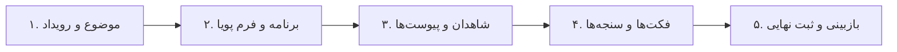
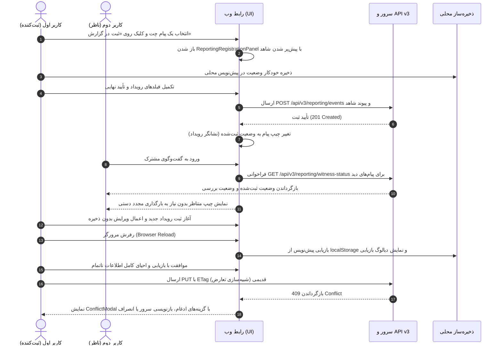

# سطح چت و پنل ثبت — فاز سه (P3-DESIGN-2026-10-03)

| مشخصه | مقدار |
| :--- | :--- |
| **شناسه سند** | `P3-DESIGN-2026-10-03` |
| **تاریخ تدوین** | ۲۰۲۶-۱۰-۰۳ |
| **سند حاکم** | `UNIFIED_REPORTING_FINAL_STRATEGY_2026-10-01.md` (بخش‌های ۶ و ۹ — فاز سه) |
| **اسناد پیش‌نیاز** | اسناد طراحی و گزارش‌های تحویل فاز یک و فاز دو گزارش‌گیری یکپارچه |
| **وضعیت سند** | `PHASE3_DESIGN_DRAFT` |
| **مبنای کد واقعی** | `ui/src/MessageContentCard.tsx` (۳۸۲ خط، چیپ‌های ایندکس و usage وردپرس)،<br>`ui/src/ReportingWorkbench.tsx` (۲۵۲۱ خط، Dialog تمام‌صفحه)،<br>`ui/src/App.tsx` (۳۰۰۰ خط، انتخاب چندتایی موجود)،<br>`ui/src/lib/api.ts` |

---

## ۱. حالت‌های ضروری و نگاشت UI (بخش ۶ سند حاکم)

در راستای انطباق با بخش ۶ سند راهبرد جامع، وضعیت انتساب و جریان کاری گزارش‌گیری باید به شکل صریح و بدون ابهام در سطح رابط کاربری بازنمایی شود.

### جدول نگاشت حالات به مؤلفه‌های رابط کاربری

| حالت وضعیت | مؤلفهٔ UI | متن و آیکون | اقدام بعدی پیشنهادی |
| :--- | :--- | :--- | :--- |
| **شاهد جدید (بدون ثبت)** | `MessageContentCard` (در بخش چیپ‌ها و اکشن‌ها) | متن: «ثبت‌نشده»<br>آیکون: `DocumentPlusIcon`<br>رنگ: خنثی / خاکستری | کلیک روی «ثبت در گزارش» جهت گشودن پنل ثبت با پیش‌پر کردن شاهد |
| **شاهد مرتبط (مستقیم)** | `MessageContentCard` (چیپ وضعیت گزارش) | متن: «ثبت در رویداد» + نام/شناسه رویداد<br>آیکون: `LinkIcon`<br>رنگ: منطبق با وضعیت بررسی (`review_status`) | کلیک جهت باز کردن پروندهٔ رویداد در میز کار گزارش‌گیری |
| **شاهد مشابه (نامزد پیشنهادی)** | `MessageContentCard` / نوار کمکی | متن: «شاهد مشابه شناسایی شد»<br>آیکون: `SparklesIcon`<br>رنگ: زرد کهربایی ملایم | بررسی پیشنهاد و انتخاب «الصاق به عنوان شاهد پشتیبان» یا «نادیده گرفتن» |
| **پیشنهاد کم‌اطمینان** | اعلان هوشمند در پنل ثبت | متن: «پیشنهاد با اطمینان پایین»<br>آیکون: `QuestionMarkCircleIcon`<br>رنگ: زرد هشدار | نیاز به بازبینی دستی کاربر و پر کردن فیلد «دلیل انتخاب» قبل از الصاق |
| **سند ناموجود / حذف‌شده** | چیپ نشانگر وضعیت شاهد در پنل رویداد | متن: «شاهد جداشده / ناموجود»<br>آیکون: `ExclamationTriangleIcon`<br>رنگ: خاکستری با خط‌خوردگی متنی | امکان بازبینی تاریخچه جداسازی یا پیوند مجدد پیام معتبر |
| **پیش‌نویس (Draft)** | چیپ و نشانگر وضعیت پرونده | متن: «پیش‌نویس»<br>آیکون: `PencilSquareIcon`<br>رنگ: آبی ملایم | تکمیل فیلدهای اجباری، فکت‌ها و ارسال برای بازبینی |
| **نیازمند بازبینی (Needs Review)** | چیپ و نشانگر وضعیت رویداد | متن: «نیازمند بازبینی»<br>آیکون: `ClockIcon`<br>رنگ: نارنجی | بررسی توسط ارزیاب یا مدیر جهت تأیید یا ارجاع با بازخورد |
| **تأییدشده (Approved)** | چیپ و نشانگر وضعیت نهایی رویداد | متن: «تأییدشده»<br>آیکون: `CheckCircleIcon`<br>رنگ: سبز رسمی | بایگانی نهایی، استخراج گزارش آماری یا انتشار به پرتال |
| **تعارض همروندی (Conflict)** | دیالوگ اختصاصی تعارض (`ConflictModal`) | متن: «تعارض در داده‌های هم‌زمان»<br>آیکون: `ArrowsRightLeftIcon`<br>رنگ: قرمز هشدار | انتخاب یکی از سه اقدام: پذیرش سرور، ادغام دستی، یا انصراف |
| **خطای ارتباط (Network Error)** | نوار بنر خطا در بالای پنل / کارت | متن: «خطای ارتباط با سرور»<br>آیکون: `CloudArrowDownIcon`<br>رنگ: زرد/قرمز هشدار | دکمهٔ «تلاش مجدد»؛ حفظ کامل پیش‌نویس در ذخیره‌ساز محلی |

### اصل حیاتی دسترس‌پذیری (Accessibility)
مطابق با بند ۳ از بخش ۴ سند حاکم:
- **معنا هرگز نباید صرفاً با رنگ منتقل شود**: هر برچسب یا نشانگر بصری باید ترکیبی از **متن صریح + آیکون استاندارد** باشد.
- کادر تمایز وضعیت «ثبت‌شده» (کادر اختصاصی پیام) همواره باید با چیپ متنی دارای وضعیت بررسی (`review_status`) و آیکون معنادار همراه گردد.
- تول‌تیپ (Tooltip) چیپ وضعیت، شناسه رویداد (`event_id`)، عنوان خلاصه رویداد و نقش شاهد (`primary` یا `supporting`) را ارائه می‌دهد تا کاربر بدون نیاز به کلیک، زمینه انتساب را دریابد.

---

## ۲. کارت پیام (`MessageContentCard`)

مؤلفهٔ `ui/src/MessageContentCard.tsx` به عنوان سطح اصلی تعامل در گفت‌وگو، با قابلیت‌های زیر توسعه داده می‌شود بدون اینکه در پایداری و عملکرد نمایش پیام‌های پرحجم خللی ایجاد شود.

### ۱. پراپ جدید و منبع داده
- تعریف پراپ جدید برای هر پیام:
  ```typescript
  export interface MessageReportUsage {
    registered: boolean;
    events: Array<{
      event_id: string;
      role: 'primary' | 'supporting';
      review_status: 'draft' | 'needs_review' | 'approved' | 'conflict';
    }>;
  }
  ```
- **منبع داده و بهینه‌سازی دسته‌ای**: وضعیت ثبت پیام‌ها از اندپوینت دسته‌ای `GET /api/v3/reporting/witness-status` (مشروح در بخش ۴) دریافت می‌شود. پیام‌های مرئی در پنجره دید (Viewport) به شکل تجمیعی (Debounced Batching) استعلام می‌شوند تا از ارسال صدها درخواست تک‌پیامی جلوگیری شود.

### ۲. چیپ وضعیت گزارش‌گیری
- استقرار چیپ «ثبت در گزارش» در کنار چیپ‌های موجود ایندکس‌گذاری و کاربری وردپرس:
  - **حالت بدون ثبت**: نمایش چیپ خنثی «ثبت‌نشده» به همراه دکمه عملیاتی فوری جهت ثبت در رویداد جدید یا الصاق به رویداد موجود.
  - **حالت ثبت‌شده**: تغییر پالت و تریم چیپ بر اساس `review_status` اولین رویداد مرتبط (پیش‌نویس: آبی؛ نیازمند بازبینی: نارنجی؛ تأییدشده: سبز؛ تعارض: قرمز) همراه با متن صریح، آیکون اختصاصی و تول‌تیپ حاوی شناسه رویداد.
  - **رفتار کلیک روی چیپ**: باز کردن مستقیم پرونده مربوط به رویداد در پنل ثبت/میز کار گزارش‌گیری.

### ۳. دکمهٔ اقدام در نوار ابزار کارت (`CardActions`)
- افزودن اکشن صریح «ثبت در گزارش» در نوار عملیات پیام‌های تکی:
  - کلیک روی این دکمه موجب باز شدن پنل ثبت (`ReportingRegistrationPanel`) با پیش‌پر کردن خودکار این پیام به عنوان شاهد اصلی (`primary`) می‌گردد.

### ۴. رفتار کلیک کارت پیام ثبت‌شده
- چنانچه پیامی پیش‌تر به عنوان شاهد ثبت شده باشد، علاوه بر چیپ، کلیک بر روی بخش نشانگر وضعیت کارت (مشابه الگوی اثبات‌شدهٔ `openUsage` در وردپرس) پرونده کامل رویداد متناظر را در پنل ثبت یا `ReportingWorkbench` لود می‌کند.

---

## ۳. پنل ثبت اختصاصی (`ReportingRegistrationPanel.tsx`)

این مؤلفهٔ مستقل برای ثبت و ویرایش جامع رویدادها، شاهدان و فکت‌ها پیاده‌سازی می‌شود.

### ۱. الگوی باز شدن و طراحی واکنش‌گرا (Responsive)
- **الگوی نمایش**: پنجره محاوره‌ای تمام‌صفحه (`Dialog` تمام‌صفحه)، هم‌تراز با معماری پیاده‌شده در `ui/src/ReportingWorkbench.tsx`.
- **اصل معماری منع فشردگی**: فرم ثبت رویداد به هیچ عنوان در ستون باریک تاریخچه چت فشرده نمی‌شود.
- **چیدمان دسکتاپ**: پنل عریض دو ستونه:
  - **ستون اصلی (راست)**: فرم داده‌ها، مراحل گام‌به‌گام و فرم‌های پویا.
  - **ستون جانبی (چپ)**: پیش‌نمایش زنده شاهدان پیوست‌شده، محتوای متن پیام، پیوست‌های چندرسانه‌ای و فراداده‌های چت.
- **چیدمان موبایل**: چیدمان مرحله‌ای تمام‌صفحه با استپر پیشرفت افقی/عمودی (`Mobile Stepper`)، با دکمه‌های ناوبری «قبلی/بعدی» در پایین صفحه.

### ۲. گام‌های پنج‌گانه فرایند ثبت



#### گام ۱: موضوع و رویداد
- ورودی عنوان رویداد (`title`)، شرح تفصیلی رویداد (`description`).
- تاریخ وقوع جلالی: بهره‌گیری الزامی از موتور تاریخ جلالی پرتال مرجع بدون توسعه کتابخانه موازی.
- انتخاب مناسبت (`occasion`) از فهرست مناسبت‌های معتبر تقویمی پرتال.

#### گام ۲: برنامه و فرم پویا
- واکشی فهرست برنامه‌ها از مسیر `/api/v2/reporting/mandates` و فرم‌های وابسته از `/api/v2/reporting/forms`.
- رندر پویای سؤالات فرم بر پایه `form_definitions` با پشتیبانی کامل از انواع ورودی (`text`، `number`، `select`، `multi_select`، `boolean` و غیره).
- اعمال دقیق قواعد اعتبارسنجی سمت کلاینت همگام با الگوهای اعتبارسنجی بک‌اند.

#### گام ۳: شاهدان پیام
- پیش‌پر کردن خودکار لیست شاهدها از پیام یا پیام‌های انتخابی چت.
- جدول فهرست شاهدها شامل: شناسه حساب (`account_id`)، شناسه طرف گفتگو (`peer_id`)، شناسه پیام (`message_id`)، و نقش شاهد (`role`: `primary` یا `supporting`).
- الزام ورود دلیل برای شاهدان پشتیبان (`supporting`): کاربر موظف است در فیلد متنی دلیل ضرورت الصاق پیام تکمیلی را قید کند.
- **حفظ هویت مستقل پیام‌ها**: حتی در صورتی که چندین پیام درون یک گروه رسانه‌ای (Album) قرار داشته باشند، هویت و شناسه تک‌تک پیام‌ها به‌طور مجزا حفظ و ارسال می‌شود.

#### گام ۴: فکت‌ها و سنجه‌ها
- افزودن ردیف‌های مقادیر سنجش‌پذیر مرتبط با رویداد.
- فیلدها: نام سنجه (`metric`)، مقدار عددی/متنی (`value`)، نوع داده (`value_type` اعم از `int`، `float`، `string`، `boolean`)، و واحد سنجش (`unit`).

#### گام ۵: بازبینی و ثبت نهایی
- نمایش خلاصه کامل پرونده پیش از ذخیره.
- سازوکار دو مرحله‌ای تراکنشی:
  ۱. صدور درخواست ایجاد یا به‌روزرسانی پیش‌نویس با `POST /api/v3/reporting/events`.
  ۲. پیوند تراکنشی تک‌تک شاهدان از طریق فراخوانی اندپوینت `POST /api/v3/reporting/events/{event_id}/witnesses`.
- نمایش نتیجهٔ ثبت هر شاهد به تفکیک ردیف.
- **مدیریت خطای تعارض شاهد (HTTP 409 Conflict)**: در صورت انتساب پیام به عنوان شاهد اصلی در رویدادی دیگر، خطای ۴۰۹ به همراه پیوند مستقیم به پروندهٔ رویداد موجود نمایش داده شده و به کاربر دو انتخاب داده می‌شود:
  - تبدیل نقش به شاهد پشتیبان (`supporting`) با درج دلیل موجه.
  - انصراف از الصاق شاهد مربوطه.

### ۳. پیش‌نویس محلی مستقل و پایداری در برابر رخدادها
- ذخیره‌سازی خودکار محلی پیوسته در `localStorage` با کلیدهای دارای محدوده مشخص (`scoped key` شامل شناسه حساب و کاربر).
- در صورت بازگشایی مجدد پنل، وجود پیش‌نویس ذخیره‌شده بررسی و در صورت انطباق، دیالوگ بازیابی پیش‌نویس ناتمام به کاربر نمایش داده می‌شود.
- **محافظت از تغییرات**: در صورت تلاش برای بستن پنلی که دارای تغییرات ذخیره‌نشده است، هشدار قطعی و صریح نمایش داده می‌شود تا از مفقود شدن ناخواسته داده‌ها جلوگیری گردد (بخش ۶ سند حاکم).

### ۴. مدیریت تعارض همروندی (Concurrency & ETag)
- تمامی درخواست‌های به‌روزرسانی (`PUT`) ملزم به ارسال سربرگ `If-Match` با مقدار آخرین `ETag` معتبر رکورد هستند.
- در مواجهه با پاسخ `409 Conflict`، دیالوگ اختصاصی تعارض باز شده و نسخه فعلی موجود در سرور در برابر تغییرات محلی کاربر مقایسه می‌شود. کاربر سه انتخاب خواهد داشت:
  ۱. پذیرش داده‌های سرور و باطل کردن تغییرات محلی.
  ۲. ادغام دستی فیلد به فیلد تغییرات.
  ۳. انصراف و بازگشت به نمای پیشین.
- اصل تضمین‌شده: آخرین ذخیره هرگز نباید بی‌صدا تغییرات پیشین را بازنویسی کند (No Silent Overwrite).

### ۵. تاب‌آوری در برابر خطای ارتباطی
- در صورت قطع ارتباط شبکه، نوار بنر خطا به همراه دکمه «تلاش مجدد» در بالای پنل ظاهر می‌شود.
- پیش‌نویس کاربر در حافظه محلی کاملاً حفظ شده و تا زمان پایداری مجدد اتصال هیچ داده‌ای از دست نخواهد رفت.

---

## ۴. APIهای پشتیبان جدید (P3-B)

برای پشتیبانی کارآمد از سطح چت بدون بارگذاری سنگین بر ساختار داده‌های موجود، این اندپوینت جدید با مشخصات دقیق زیر پیاده‌سازی می‌گردد:

### مشخصات اندپوینت وضعیت شاهد
- **مسیر و متد**: `GET /api/v3/reporting/witness-status`
- **پارامترهای پرسمان (Query Parameters)**:
  - `peer_id` (اجباری): شناسه مخاطب یا گروه ایتا.
  - `message_id` (اجباری): فهرست شناسه‌های پیام با کاما جداشده (`m1,m2,m3,...`).
- **ساختار پاسخ (JSON)**:
  ```json
  {
    "statuses": [
      {
        "peer_id": "user_12345",
        "message_id": 98765,
        "registered": true,
        "events": [
          {
            "event_id": "evt-2026-0042",
            "role": "primary",
            "review_status": "needs_review"
          }
        ]
      },
      {
        "peer_id": "user_12345",
        "message_id": 98766,
        "registered": false,
        "events": []
      }
    ]
  }
  ```

### دامنه و منطق لایه داده (Store)
- **محدودیت ارائه‌دهنده**: این استعلام منحصراً برای رکوردهای با `provider = 'eitaa'` اجرا می‌شود.
- **متد جدید در Store**: پیاده‌سازی متد `find_witness_status(peer_id, message_ids)`.
- **منطق پرسمان پایگاه‌داده**:
  اتصال مستقیم جداول زیر با رعایت وضعیت جداسازی:
  ```sql
  SELECT
      w.peer_id,
      w.message_id,
      l.event_id,
      l.role,
      e.review_status,
      l.detached_at
  FROM reporting_message_witnesses w
  JOIN reporting_event_witness_links l ON w.witness_id = l.witness_id
  JOIN reported_events e ON l.event_id = e.event_id
  WHERE w.provider = 'eitaa'
    AND w.peer_id = :peer_id
    AND w.message_id IN (:message_ids)
    AND l.detached_at IS NULL
    AND l.role != 'detached';
  ```
- **قاعده پیوندهای جداشده**: پیوندهایی که دارای مقدار زمان جداسازی (`detached_at IS NOT NULL`) بوده یا نقش آن‌ها به `detached` تغییر یافته باشد، به عنوان شاهد فعال شمرده نشده و برای آن پیام `registered = false` گزارش می‌گردد.
- **تضمین پایداری نسخه ۲**: هیچ‌گونه تغییر شکسته‌کننده (Breaking Change) در قراردادهای `/api/v2/*` ایجاد نخواهد شد.

---

## ۵. جریان انتخاب چندتایی و ثبت دستی

### ۱. انتخاب چندتایی از نوار ابزار `App.tsx`
- در نوار عملیات ناشی از انتخاب چند پیام (موجود در سورس ۳۰۰۰ خطی `App.tsx`):
  - اضافه شدن دکمهٔ «ثبت در گزارش» همراه با برچسب شمارشگر پیام‌های انتخاب‌شده (مثلاً «ثبت ۳ پیام در گزارش»).
  - باز شدن پنل ثبت (`ReportingRegistrationPanel`) با پیش‌پر کردن آرایه شاهدان از روی شناسه‌های تمامی پیام‌های انتخابی.
  - حفظ هویت و تفکیک تک‌تک پیام‌ها، حتی در حالتی که کلاینت پیام‌ها را در قالب آلبوم چندرسانه‌ای تجمیع کرده باشد.

### ۲. ثبت دستی رویداد در میز کار
- در مؤلفهٔ `ReportingWorkbench.tsx` دکمه اختصاصی «ثبت دستی رویداد» تعبیه می‌شود.
- این دکمه همان پنل ثبت (`ReportingRegistrationPanel`) را باز می‌کند، با این تفاوت که آرایه شاهدان در آغاز کاملاً خالی بوده و کاربر می‌تواند بعداً شناسه پیام یا مستندات خارجی را الحاق نماید.

---

## ۶. نقشهٔ پذیرش دروازهٔ فاز سه (بخش ۹ سند حاکم) و طرح آزمون مرورگری

### معیارهای پذیرش کارکردی دروازه
۱. جریان هدایت از «یک پیام»، «چند پیام انتخابی» و «ورودی ثبت دستی» به شکل یکنواخت به باز شدن پرونده رویداد با داده‌های صحیح منجر گردد.
۲. پیام‌های منتسب، وضعیت بررسی خود را به شکل بی‌درنگ و صحیح منعکس نموده و اقدام بعدی متناسب ارائه دهند.
۳. در صورت خروج ناگهانی کاربر یا بارگذاری مجدد، فرم‌های ناتمام و پیش‌نویس‌ها بدون ریزش داده بازیابی گردند.

### طرح آزمون جامع مرورگری (P3-D — الزام بازبینی بصری)
مطابق الزام مالک پروژه، سناریوی آزمون مرورگری زنده با گردش کار زیر به اجرا درمی‌آید:



### چک‌لیست تأییدیه فنی و بازبینی بصری
- [ ] راه‌اندازی هم‌زمان سرویس بک‌اند پایتون و سرور توسعه کاربری (`ui`).
- [ ] ثبت یک پیام توسط کاربر اول و مشاهده تغییر وضعیت چیپ روی کارت پیام.
- [ ] ارزیابی نمایش صحیح و تغییر بلافاصله وضعیت برای کاربر دوم از طریق استعلام `witness-status`.
- [ ] سنجش ماندگاری و بازیابی پیش‌نویس پس از بازنشانی (Refresh) کامل صفحه مرورگر.
- [ ] شبیه‌سازی سناریوی تعارض برچسب نسخه (ETag Conflict) و پایداری دیالوگ رفع تعارض.
- [ ] تهیه اسکرین‌شات از وضعیت چیپ پیام و عملکرد پنل ثبت در هر دو نمای دسکتاپ و موبایل.
- [ ] اجرای موفق اعتبارسنجی تایپ‌ها (`npm run check` / `tsc`) در بخش کاربری.
- [ ] اجرای کامل و بدون خطای مجموعه آزمون‌های بک‌اند (`pytest`).

---

> **پاورقی و اصول معماری تخطی‌ناپذیر**:
> ۱. هیچ تغییری در قراردادهای جاری نسخه ۲ (`/api/v2/reporting/*`) اعمال نخواهد شد.
> ۲. هیچ پیاده‌سازی موازی از موتور تقویم جلالی انجام نمی‌شود و موتور مرجع پرتال تنها مبنای محاسبه تاریخ است.
> ۳. کدهای موجود در `MessageContentCard.tsx`، `ReportingWorkbench.tsx` و `App.tsx` اساس تکمیل هستند و هرگونه بازنویسی از صفر ممنوع است.
