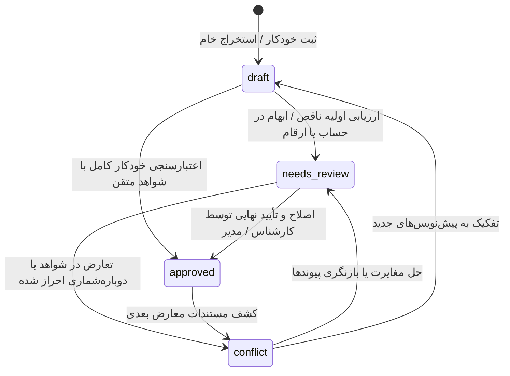
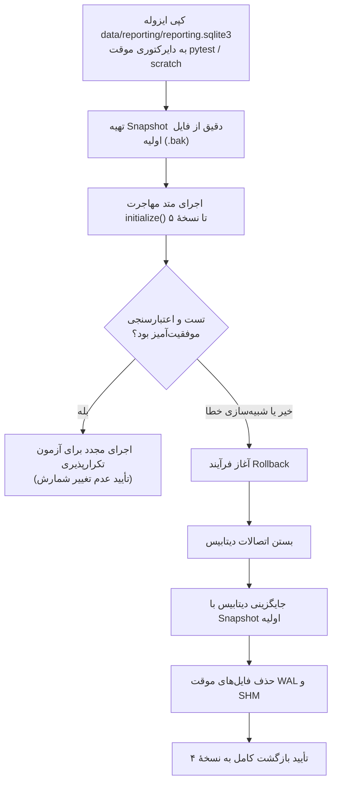

# مدل دامنه و مهاجرت v5 — فاز یک راهبرد گزارشگیری یکپارچه

| مشخصه | مقدار |
| :--- | :--- |
| **شناسهٔ سند** | `DOMAIN-MODEL-V5-2026-10-03` |
| **تاریخ تدوین** | ۲۰۲۶-۱۰-۰۳ |
| **سند حاکم** | [UNIFIED_REPORTING_FINAL_STRATEGY_2026-10-01.md](UNIFIED_REPORTING_FINAL_STRATEGY_2026-10-01.md) (بخش‌های ۳ الی ۵) |
| **وضعیت سند** | `PHASE1_DESIGN_DRAFT` |
| **دامنهٔ اثر** | سامانهٔ گزارش‌گیری یکپارچهٔ EitaaBridge (`src/eitaa_bridge/reporting/`) |

---

## ۱. واژگان دامنه و قواعد شمارش

### ۱.۱ جدول واژگان بنیادین دامنه (Domain Ubiquitous Language)

برای تثبیت تعاریف مفهومی و جلوگیری از اختلاط لایه‌ها (مانند یکسان انگاشتن پیام پیام‌رسان با رخداد واقعی یا پست وردپرس)، واژگان کلیدی دامنه مطابق جدول زیر تثبیت می‌شوند:

| واژهٔ کلیدی | تعریف عملیاتی و دامنهٔ مفهومی | جایگاه در چرخهٔ داده | تمایز و مرز مفهومی |
| :--- | :--- | :--- | :--- |
| **شاهد (Witness)** | رخداد ثبتی یا اثر دیجیتال ملموس (مانند پیام پیام‌رسان، سند، رسانه، یا ورودی دستی با منشأ و زمان مشاهدهٔ معین). | ورودی خام اثبات‌پذیر (Raw Evidence) | شاهد رویداد نیست؛ یک سند یا پیام ممکن است حاکی از وقوع یک یا چند رویداد باشد یا صرفاً تأییدکننده باشد. |
| **رویداد (Event)** | رخداد عینی و تاریخی در جهان واقعی که توسط پایگاه یا کاربر گزارش شده است. | هستهٔ مرکزی پرونده (`reported_events`) | رویداد نه پست وردپرس است، نه ردیف شیت اکسل و نه پیام ایتایی؛ بلکه ماهیت مستقلی است که به شواهد استناد می‌کند. |
| **نگاشت برنامه (Program Mapping)** | پیوند پویا و نسخه‌دار رویداد به ساختار سازمانی و سرفصل‌های برنامه‌ای/مالی. | لایهٔ طبقه‌بندی و تسهیم بودجه/عملکرد | کد ابلاغی برنامه کلید پایدار نیست؛ نگاشت باید دارای نسخه و تاریخ اثربخشی باشد تا با تغییر عناوین ابلاغی تاریخچه مخدوش نشود. |
| **فکت نوع‌دار (Typed Fact)** | ارزش سنجه‌ای یا ویژگی توصیفی رویداد/نهاد که نوع، واحد، دوره، منبع، کیفیت و وضعیت تأیید آن صریحاً تصریح شده است. | سنجه‌های تحلیلی (`event_facts`, `entity_facts`) | ذخیرهٔ متنی خام مقادیر اعشاری/عددی بدون مشخص بودن کیفیت و نوع خطرساز است. هر فکت باید نوع داده و کیفیت اعتبار داشته باشد. |
| **فرم نسخه‌دار (Versioned Form)** | الگوی ثبت ساخت‌یافته که مشخصات فیلدها و سنجه‌ها را تعریف کرده و دارای نگارش صریح است. | قالب‌بندی داده (`form_definitions`, `filled_forms`) | فرم‌های تکمیل‌شده بدون اشاره به نسخهٔ دقیق فرم دچار ناهماهنگی در اعتبارسنجی فیلدهای آتی می‌شوند. |
| **مدرک / رسانه (Document / Media)** | فایل الصاقی، عکس، ویدیو، پوستر یا صورت‌جلسهٔ متصل به رویداد با شناسهٔ مات (`opaque id`) و چک‌سام یکپارچگی. | پیوست پرونده (`event_documents`) | فایل‌ها نباید با مسیر محلی مطلق سیستم منتشر شوند؛ باید از طریق شناسهٔ امن و کنترل سطح دسترسی ارائه شوند. |
| **پیوند خروجی (Outbound Link)** | رکورد انتشار رویداد روی بسترهای خارجی (مانند وردپرس، پیام‌رسان، اکسل و پورتال‌های آماری). | لایهٔ خروجی و گزارش‌دهی | خروجی صرفاً بازتابی از رویداد است؛ بازتولید رویداد در خروجی نباید رویداد جدید تولید کند. |

---

### ۱.۲ قواعد شمارش و جلوگیری از دوباره‌شماری (Counting Principles)

1. **یکتایی پایه در سنجه‌ها**: هر سنجهٔ آماری یا شمارشی (تعداد جلسات، مخاطبان، هزینه‌کرد و نظایر آن) دارای فرمول تخصیص و دامنهٔ معین است. هیچ شاهد یا رویدادی نباید دو بار در یک خط پایهٔ تحلیلی شمرده شود.
2. **نقش شاهد در رویداد (Primary vs. Supporting)**:
   - هر شاهد پیام‌رسان در لحظهٔ فعال بودن حداکثر می‌تواند به عنوان **شاهد اصلی (`primary`)** برای **یک رویداد** تخصیص یابد.
   - الصاق یک شاهد به عنوان **شاهد پشتیبان (`supporting`)** به رویدادهای دیگر، تنها با اعلام دلیل صریح و تایید در صف بازبینی مجاز است.
3. **پوشش چندسرفصلی (رویداد چندمنظوره)**:
   - چنانچه یک رویداد هم‌زمان ذیل دو جدول ابلاغی یا دو شیت گزارش‌گیری قرار گیرد، نباید دو رکورد `reported_events` ایجاد شود.
   - پوشش چندگانه منحصراً از طریق نگاشت‌های چندگانهٔ برنامه‌ای (`program mappings`) روی همان رویداد واحد پیاده‌سازی می‌شود.
4. **ردیف مستقل و تفکیک پرونده**: اگر دو فعالیت متمایز در یک پیام پیام‌رسان اعلام شده باشند، دو رویداد مجزا تعریف می‌شوند؛ پیام به عنوان شاهد اصلی رویداد اول و شاهد پشتیبان رویداد دوم با درج علت ثبت می‌گردد.

---

### ۱.۳ چرخهٔ وضعیت بررسی رویداد (Review Status Lifecycle)

**اصلاحیهٔ راستی‌آزمایی (2026-10-03):** جدول `reported_events` در اسکیمای فعلی هیچ ستون `review_status` ندارد (ستون‌های `review_status` موجود فقط روی `event_candidates` با مقادیر pending/approved/rejected و `wp_post_links.match_status` هستند). پس فاز یک این ستون را **تازه** روی رویدادها اضافه می‌کند:

```sql
ALTER TABLE reported_events ADD COLUMN review_status TEXT NOT NULL DEFAULT 'needs_review'
    CHECK(review_status IN ('draft', 'needs_review', 'approved', 'conflict'));
```

مقدار پیش‌فرض برای ۳۴ رویداد تاریخی عمداً `needs_review` است (محافظه‌کار، بدون حدسِ تأیید)؛ رویدادهای تازه در کد با `draft` ثبت می‌شوند. تا فاز دو هیچ خواندنی بر اساس این ستون فیلتر نمی‌کند و خروجی‌های فعلی بدون تغییر می‌مانند.



#### جدول نگاشت وضعیت‌های موجود به وضعیت‌های جدید

| وضعیت جدید | واقعیت سیستم فعلی (وارسی کد، 2026-10-03) | شرایط ورود و معنی | مسئول تغییر وضعیت |
| :--- | :--- | :--- | :--- |
| **`draft`** | ستون هنوز وجود نداشت؛ رویدادهای تازه از این پس با کد `draft` ثبت می‌شوند | رویداد تازه ثبت شده و هنوز تحلیل نهایی نشده است. | سامانه (در زمان استخراج) یا رابط کاربری پیش‌نویس |
| **`needs_review`** | مقدار پیش‌فرض ALTER برای ۳۴ رویداد تاریخی | رویداد تاریخی نیازمند تأیید انسانی وضعیت و شواهد است. | مهاجرت خودکار (فقط بار اول) |
| **`approved`** | معادل معنایی `confirmed` در `wp_post_links.match_status` (۳۴ رکورد) و `approved` در `event_candidates` | رویداد دارای حداقل یک شاهد معتبر و فاقد هرگونه تعارض است. | کارشناس انسانی با نقش تأییدکننده |
| **`conflict`** | معادل معنایی `unmatched`/`candidate` در `wp_post_links` | رویداد دارای شواهد متناقض یا مغایرت مقادیر است. | موتور اعتبارسنجی داده یا کارشناس ناظر |

#### جدول ماتریس انتقال وضعیت (State Transition Matrix)

| مبدأ | مقصد | شرط انتقال | عامل مجاز |
| :--- | :--- | :--- | :--- |
| `draft` | `needs_review` | عدم انطباق با قواعد فرمت، حساب ناشناختهٔ شاهد یا فکت‌های legacy | موتور اعتبارسنجی قوانین |
| `draft` | `approved` | تطابق کامل با فیلدهای اجباری و داشتن شاهد primary قطعی | سامانه / اپراتور |
| `needs_review` | `approved` | تأیید فکت‌ها، رفع ابهام شناسهٔ شاهد و ثبت توضیحات تکمیلی | کاربر کارشناس (با ثبت شناسهٔ کاربر) |
| `needs_review` | `conflict` | تشخیص تعارض با رویداد دیگر در پایگاه یا گزارش شواهد معارض | کارشناس / بازبین سامانه |
| `approved` | `conflict` | الحاق شاهد معارض جدید یا گزارش ابطال توسط کاربر ارشد | بازبین ارشد / مدیر سیستم |
| `conflict` | `needs_review` | حذف پیوند معارض یا اصلاح مقادیر فکت به مقادیر مستند | کارشناس پس از حل تعارض |

---

## ۲. دستورات DDL مهاجرت نسخه ۵ (`REPORTING_SCHEMA_VERSION = 5`)

الگوی مهاجرت در سیستم گزارش‌گیری EitaaBridge به‌صورت گام‌های شرطی تکرارپذیر (`idempotent`) داخل متد `initialize()` در مسیر `src/eitaa_bridge/reporting/store.py` پیاده‌سازی می‌گردد. مقدار ثبات نسخه از ۴ به ۵ ارتقا می‌یابد:
```python
REPORTING_SCHEMA_VERSION = 5
```

---

### ۲.۱ جدول شواهد پیام‌رسان (`reporting_message_witnesses`)

این جدول هویت اثباتی پیام را از منطق رویداد جدا می‌کند.

```sql
CREATE TABLE IF NOT EXISTS reporting_message_witnesses (
    witness_id TEXT PRIMARY KEY,
    provider TEXT NOT NULL DEFAULT 'eitaa',
    messenger_account TEXT NOT NULL DEFAULT '',
    peer_id TEXT NOT NULL,
    message_id TEXT NOT NULL,
    observed_at TEXT,
    created_at TEXT NOT NULL
);

-- ایندکس یکتای بیان‌محور (Expression-based Unique Index)
-- این ایندکس مانع از ثبت دوگانهٔ یک پیام در پیام‌رسان ذیل یک حساب می‌شود، حتی اگر مقدار حساب خالی باشد.
CREATE UNIQUE INDEX IF NOT EXISTS uq_witness_identity 
ON reporting_message_witnesses(provider, COALESCE(messenger_account, ''), peer_id, message_id);

CREATE INDEX IF NOT EXISTS idx_witness_peer_msg 
ON reporting_message_witnesses(peer_id, message_id);
```

---

### ۲.۲ جدول پیوند شاهد و رویداد (`reporting_event_witness_links`)

پیوندهای چندگانه با تفکیک نقش اصلی و پشتیبان و قابلیت جداسازی منطقی (`soft detach`).

```sql
CREATE TABLE IF NOT EXISTS reporting_event_witness_links (
    link_id TEXT PRIMARY KEY,
    event_id TEXT NOT NULL,
    witness_id TEXT NOT NULL,
    role TEXT NOT NULL CHECK(role IN ('primary', 'supporting')),
    linked_by TEXT,
    linked_at TEXT NOT NULL,
    note TEXT,
    detached_at TEXT,
    detached_reason TEXT,
    FOREIGN KEY (event_id) REFERENCES reported_events(event_id) ON DELETE CASCADE,
    FOREIGN KEY (witness_id) REFERENCES reporting_message_witnesses(witness_id) ON DELETE RESTRICT
);
-- یادداشت اصلاحی راستی‌آزمایی: رفتار CASCADE برای event_id با جریان حذف موجود
-- هم‌راستاست (event_facts هم CASCADE است و delete_event در store.py فعال است)؛
-- تغییر معنای حذف رویداد (soft-delete/ممیزی) به فاز دو موکول می‌شود.

-- هر شاهد فعال فقط و فقط می‌تواند یک بار نقش شاهد اصلی (primary) را در تمام سیستم داشته باشد
CREATE UNIQUE INDEX IF NOT EXISTS uq_witness_active_primary 
ON reporting_event_witness_links(witness_id) 
WHERE role = 'primary' AND detached_at IS NULL;

-- جلوگیری از انتساب تکراری همان شاهد به همان رویداد (در حالت پیوند متصل)
CREATE UNIQUE INDEX IF NOT EXISTS uq_event_witness 
ON reporting_event_witness_links(event_id, witness_id) 
WHERE detached_at IS NULL;

CREATE INDEX IF NOT EXISTS idx_links_event_id 
ON reporting_event_witness_links(event_id);

CREATE INDEX IF NOT EXISTS idx_links_witness_id 
ON reporting_event_witness_links(witness_id);
```

---

### ۲.۳ جدول صف بازبینی (`reporting_review_queue`)

مدیریت رویدادها و داده‌های نیازمند تصمیم‌گیری انسانی بدون اعمال حدس خودکار در دیتابیس.

```sql
CREATE TABLE IF NOT EXISTS reporting_review_queue (
    queue_id TEXT PRIMARY KEY,
    item_type TEXT NOT NULL,
    ref_table TEXT NOT NULL,
    ref_id TEXT NOT NULL,
    reason TEXT NOT NULL,
    status TEXT NOT NULL DEFAULT 'open' CHECK(status IN ('open', 'resolved', 'dismissed')),
    created_at TEXT NOT NULL,
    resolved_at TEXT,
    resolved_by TEXT
);

CREATE INDEX IF NOT EXISTS idx_review_queue_lookup 
ON reporting_review_queue(ref_table, ref_id, status);

CREATE INDEX IF NOT EXISTS idx_review_queue_status 
ON reporting_review_queue(status, item_type);
```

---

### ۲.۴ فکت نوع‌دار — ارتقای جداول `event_facts` و `entity_facts`

**اصلاحیهٔ راستی‌آزمایی (2026-10-03):** محور «کیفیت/اعتبار مقدار» راهبرد (بخش ۳) هم‌اکنون با ستون `value_kind` پیاده‌سازی شده است (`FactValueKind`: observed / reported_by_unit / estimated / synthetic_placeholder / verified — مطابق model.py سطر ۲۵). ساخت ستون `quality` موازی، نقض بند ۲ پذیرش سند حاکم (پرهیز از بازطراحی موازی) است. بنابراین فقط محورهای واقعاً غایب اضافه می‌شوند: **نوع داده** (`value_type`) و **نمایش اعشاری دقیق** (`value_decimal`).

```sql
-- بررسی شرطی ستون‌ها در صورت عدم وجود (تکرارپذیر)
-- روی جدول event_facts:
ALTER TABLE event_facts ADD COLUMN value_type TEXT NOT NULL DEFAULT 'unknown'
    CHECK(value_type IN ('integer', 'decimal', 'text', 'bool', 'unknown'));

ALTER TABLE event_facts ADD COLUMN value_decimal TEXT;

-- روی جدول entity_facts:
ALTER TABLE entity_facts ADD COLUMN value_type TEXT NOT NULL DEFAULT 'unknown'
    CHECK(value_type IN ('integer', 'decimal', 'text', 'bool', 'unknown'));

ALTER TABLE entity_facts ADD COLUMN value_decimal TEXT;
```

> [!IMPORTANT]
> **رفتار با رکوردهای قدیمی**: ۶۹۶ فکت موجود (۸۵ رویدادی + ۶۱۱ نهادی) `value_type='unknown'` صریح می‌گیرند — «نامعلومِ اعلانی» است نه حدس. فکت‌های تازه در کد با نوع صریح ثبت می‌شوند. شمارش unknownها در گزارش تطبیق می‌آید و تعیین نوع آن‌ها در بازبینی رویدادهای تاریخی (آیتم صف بازبینی هر رویداد، بخش ۳) انجام می‌شود؛ صف بازبینی جداگانه برای تک‌تک فکت‌ها ساخته نمی‌شود (پرهیز از نویز ۶۹۶ ردیفی).

---

### ۲.۵ فرم‌های نسخه‌دار (`form_definitions` و `filled_forms`)

مطابق بررسی‌های اعتبارسنجی فاز صفر:
- جدول `form_definitions` از قبل دارای ستون صریح `version` می‌باشد.
- کلید جدول `filled_forms` در کد فعلی `program_id` است (نه form_id) و جدول ۰ رکورد دارد. قرارداد ذخیره‌سازی: از این پس ثبت فرم تکمیل‌شده باید نسخهٔ فرم را صریح نگه دارد:

```sql
-- در صورت عدم وجود ستون form_version روی filled_forms:
ALTER TABLE filled_forms ADD COLUMN form_version INTEGER NOT NULL DEFAULT 1;
```

---

### ۲.۶ جدول مستندات و رسانه‌های پرونده (`event_documents`)

مدیریت امن رسانه‌ها با کنترل حریم خصوصی و شناسه‌های مات (`opaque IDs`):

```sql
CREATE TABLE IF NOT EXISTS event_documents (
    document_id TEXT PRIMARY KEY,
    event_id TEXT NOT NULL,
    media_id TEXT NOT NULL,
    sha256 TEXT NOT NULL DEFAULT '',
    kind TEXT NOT NULL DEFAULT '',
    size_bytes INTEGER,
    display_order INTEGER NOT NULL DEFAULT 0,
    is_cover INTEGER NOT NULL DEFAULT 0,
    added_by TEXT,
    added_at TEXT NOT NULL,
    storage_ref TEXT NOT NULL DEFAULT '',
    FOREIGN KEY (event_id) REFERENCES reported_events(event_id) ON DELETE CASCADE
);

CREATE INDEX IF NOT EXISTS idx_documents_event 
ON event_documents(event_id, display_order);

CREATE INDEX IF NOT EXISTS idx_documents_media_sha 
ON event_documents(media_id, sha256);
```

#### الزامات حریم خصوصی و امنیت رسانه‌ها (Privacy Enforcement)
- **ممنوعیت انتشار مسیرهای محلی**: هیچ مسیر محلی مطلق سیستم کلاینت (`C:\Users\...` یا مسیرهای دیسک) یا شناسه‌های حاوی توکن و نام کاربری حساس نباید در `media_id` یا پاسخ‌های عمومی API برگردانده شود.
- **شناسهٔ مات (Opaque Ref)**: فیلد `storage_ref` تنها کلید داخلی ارجاع به مخزن رسانه است و دسترسی به فایل مستقیماً با بررسی مجوز پرونده و از طریق endpoint محافظت‌شده انجام می‌شود.

---

### ۲.۷ ستون وضعیت بررسی رویدادها (`review_status` روی `reported_events`)

ستون تازه است (در اسکیمای v4 وجود ندارد) — DDL و تحلیل کامل در بخش ۱.۳ آمده است:

```sql
ALTER TABLE reported_events ADD COLUMN review_status TEXT NOT NULL DEFAULT 'needs_review'
    CHECK(review_status IN ('draft', 'needs_review', 'approved', 'conflict'));
```

## ۳. قواعد نگاشت دادهٔ موجود (وارسی واقعی ۲۰۲۶-۱۰-۰۳)

**اصلاحیهٔ مهم نسبت به پیش‌نویس اول:** ادعای گزارش فاز صفر که «پیوند پیام رویدادها در `source_message_refs_json` روی رکورد رویداد است» در سطح جدول `reported_events` درست نیست — آن ستون فقط در `event_candidates` (۰ رکورد) و `index_decisions` (۰ رکورد) وجود دارد. وارسی فقط‌خواندنی (تکمیلی V-242) نشان داد:

- `reported_events`: ۳۴ رکورد، بدون هیچ ستون پیوند پیام؛
- تنها پیوند persisted این رویدادها `wp_post_links` است (۳۴ رکورد، همه `match_status='confirmed'`، `source_ref='wp:post:NNNN'`) که **پیوند خروجی وردپرس** است، نه شاهد ورودی؛
- پس در دادهٔ فعلی **هیچ شاهد پیامی برای مهاجرت وجود ندارد** و تبدیل پیوندهای WP به شاهد، خلطِ «خروجی» با «مدرک ورودی» و نقض تفکیک بخش ۳ سند حاکم است.

بنابراین مهاجرت v5 فقط **زیرساخت شاهد را می‌سازد** و دادهٔ قدیمی را به شاهد تبدیل نمی‌کند:

1. جداول `reporting_message_witnesses` / `reporting_event_witness_links` / `reporting_review_queue` / `event_documents` خالی ساخته می‌شوند.
2. برای هر یک از ۳۴ رویداد تاریخی یک ردیف صف بازبینی ثبت می‌شود:
   - `item_type = 'legacy_event_review'`
   - `ref_table = 'reported_events'`
   - `ref_id = event_id`
   - `reason = 'رویداد تاریخی بدون شاهد پیام ثبت‌شده؛ وضعیت تأیید نیازمند تأیید انسانی؛ N فکت با value_type=unknown'`
   - `status = 'open'`
3. `wp_post_links` دست‌نخورده می‌ماند و همان لایهٔ خروجی/آرشیو فقط-خواندنی است (تصمیم فاز صفر، گزینهٔ الف).
4. ساخت شاهد از این پس فقط از مسیر کاندیدها/پیام‌ها در فاز دو رخ می‌دهد (`event_candidates.source_message_refs_json` زیرساخت ورودی آن است).

## ۴. سازوکار تکرارپذیری (Idempotency) و بازگشت (Rollback)

### ۴.۱ ویژگی تکرارپذیری فرآیند مهاجرت
- اجرای چندبارهٔ اسکریپت مهاجرت روی یک پایگاه داده نباید تعداد رکوردهای `reporting_message_witnesses`، `reporting_event_witness_links` یا صف بازبینی را افزایش دهد یا خطا صادر کند.
- تمام عملیات DDL با شروط `IF NOT EXISTS` و بررسی متادیتای جدول با `PRAGMA table_info` اجرا می‌شوند.

### ۴.۲ روش آزمون در محیط ایزوله و فرآیند Rollback
طبق خط‌مشی ایمنی، هیچ تستی نباید روی فایل واقعی عملیاتی اجرا شود.



#### دستورالعمل Rollback در اسکریپت مهاجرت
```python
def rollback_migration(target_db_path: Path, snapshot_path: Path):
    """بازگردانی وضعیت پایگاه داده به حالت پیش از آغاز مهاجرت."""
    # ۱. بستن تمام کانکشن‌های باز به فایل دیتابیس
    # ۲. رونویسی فایل دیتابیس اصلی از روی اسنپ‌شات
    shutil.copy2(snapshot_path, target_db_path)
    # ۳. حذف فایل‌های وابسته به ژورنال موقت در صورت وجود
    wal_file = target_db_path.with_name(f"{target_db_path.name}-wal")
    shm_file = target_db_path.with_name(f"{target_db_path.name}-shm")
    if wal_file.exists():
        wal_file.unlink()
    if shm_file.exists():
        shm_file.unlink()
```

---

## ۵. قالب گزارش تطبیق داده‌ها (Reconciliation Report Template)

در انتهای فرآیند ارتقای اسکیما و مهاجرت داده، اسکریپت یک گزارش وضعیت ساخت‌یافته به صورت JSON و Markdown تولید می‌کند:

### ۵.۱ جدول خلاصهٔ شمارش موجودیت‌ها قبل و بعد از مهاجرت

| نام جدول / موجودیت | شمارش پیش از مهاجرت | شمارش پس از مهاجرت | وضعیت انطباق | توضیحات تطبیق |
| :--- | :--- | :--- | :--- | :--- |
| `reported_events` | ۳۴ | ۳۴ | انطباق کامل | ستون تازهٔ `review_status='needs_review'` برای همهٔ ردیف‌های تاریخی. |
| `event_facts` | N | N | انطباق کامل | فیلدهای ساخت‌یافته افزوده شده و مقادیر حفظ شدند. |
| `entity_facts` | M | M | انطباق کامل | ارتقای ستون‌ها بدون ریزش سطرها صورت گرفت. |
| `reporting_message_witnesses` | ۰ | ۰ | آماده‌سازی | دادهٔ تاریخی هیچ شاهد پیامی ندارد (بخش ۳)؛ پر شدن جدول از فاز دو. |
| `reporting_event_witness_links` | ۰ | ۰ | آماده‌سازی | بدون شاهد، پیوندی ساخته نمی‌شود؛ خلط WP با شاهد ممنوع. |
| `reporting_review_queue` | ۰ | ۳۴ | تولید جدید | یک آیتم `legacy_event_review` برای هر رویداد تاریخی. |
| `event_documents` | ۰ | ۰ | آماده‌سازی | جدول آماده برای الصاق مدارک در فازهای بعدی. |

### ۵.۲ جدول گزارش موارد استثنا و ناهماهنگی (Exceptions & Anomalies)

| نوع بررسی مغایرت | شرط خطا | نتیجه در اجرای آزمایشی | اقدام اصلاحی |
| :--- | :--- | :--- | :--- |
| **پیوندهای شکسته (Broken Links)** | رویدادی که فاقد هرگونه شاهد فعال `primary` باشد. | ۳۴ رویداد تاریخی (وضع شناخته‌شده، بخش ۳) | پوشش با همان آیتم `legacy_event_review` هر رویداد؛ صف جداگانه‌ی نویزساز ساخته نمی‌شود. |
| **داده‌های ناقص (Missing Account)** | شواهدی که فیلد `messenger_account` آنها خالی است. | ۰ (هیچ شاهدی وجود ندارد) | از فاز دو، ثبت شاهد بدون حساب با آیتم بازبینی همراه می‌شود. |
| **تعارض شناسه (Duplicate Key)** | دو شاهد با مشخصات یکسان یا نقض ایندکس بیان‌محور. | ۰ تعارض | رد ثبت رکورد تکراری از طریق ایندکس `uq_witness_identity` (آزمون خودکار دارد) |
| **بررسی چک‌سام رسانه** | عدم تطابق اندازه یا هش SHA-256 فایل‌های مدرک. | ۰ مغایرت (فایل جدیدی بارگذاری نشده) | الزام درج SHA-256 در لحظهٔ افزودن سند جدید |

---

## ۶. نقشهٔ پذیرش دروازهٔ فاز یک (Phase 1 Acceptance Gate)

برای عبور رسمی از دروازهٔ کنترل کیفیت فاز یک راهبرد یکپارچگی گزارش‌گیری، تحقق شروط زیر به‌صورت الزامی آزموده و تأیید می‌شود:

1. **تکرارپذیری ۱۰۰٪ مهاجرت (`Migration Idempotency`)**:
   - اجرای متوالی متد مهاجرت روی یک پایگاه داده در تست‌های خودکار هیچ تغییر ناخواسته یا خطایی ایجاد نکرده و شمارش کلیدها دقیقاً ثابت بماند.
2. **عدم ریزش داده‌های تاریخی (Zero Data Loss)**:
   - هر ۳۴ رویداد تاریخی، ۸۵ فکت رویدادی، ۶۱۱ فکت نهادی و ۳۴ پیوند `wp_post_links` پس از مهاجرت دست‌نخورده باقی بمانند و برای هر رویداد یک آیتم `legacy_event_review` در صف بازبینی ثبت شده باشد؛ هیچ داده‌ای به شاهد «تبدیل» نمی‌شود چون شاهد پیامی در دادهٔ قدیمی وجود ندارد (بخش ۳).
3. **آزمون عملیاتی بازیابی و بازگشت (`Rollback Verification`)**:
   - آزمون خودکار فرآیند Rollback در محیط ایزوله نشان دهد که پس از بازگشت به Snapshot، وضعیت دیتابیس بدون هیچ پسماندی عینا به ساختار نسخهٔ ۴ بازمی‌گردد.
4. **توقف کامل حدس خودکار داده‌های مبهم**:
   - کلیهٔ شواهد قدیمی با حساب نامشخص و مقادیر فکت با کیفیت نامعین، منحصراً با برچسب‌های استاندارد (`legacy_unclassified`) در جدول صف بازبینی (`reporting_review_queue`) مستند گردند.
5. **پاس شدن کامل آزمون‌های رگرسیون و آزمون‌های مهاجرت**:
   - اجرای کامل تست‌های سامانهٔ گزارش‌گیری با دستور زیر بدون کوچک‌ترین خطا و هشدار جدید سبز شود:
     ```powershell
     .\.venv\Scripts\python.exe -m pytest -q tests/test_reporting*.py
     ```

---

> [!NOTE]
> **پاورقی و استناد**: مفاد این سند منحصراً بر پایهٔ واقعیت‌های وارسیشدهٔ فاز صفر مندرج در [docs/reports/PHASE0_REPORT_UNIFIED_REPORTING_2026-10-01.md](../reports/PHASE0_REPORT_UNIFIED_REPORTING_2026-10-01.md) و یافته‌های ثبت‌شده در Ledger (شناسه‌های `V-242` و `V-243`) استوار است. شمارهٔ نسخهٔ اسکیما (`v5`) مستقیماً از بررسی کد منبع زنجیرهٔ مهاجرت‌های موجود در استور گزارش‌گیری استخراج شده و ادعاهای اسناد قدیمی نامنطبق با کد ملاک قرار نگرفته است.
