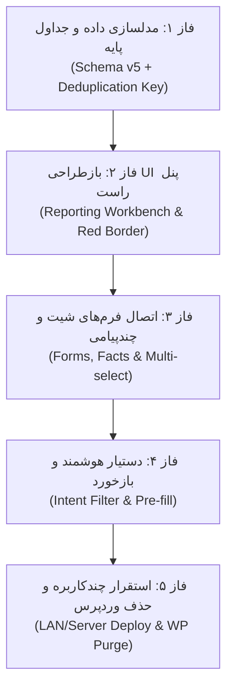

# سند طرح جامع: بازطراحی فونداسیون معماری سامانه گزارش‌گیری یکپارچه
## حذف پشتهٔ وردپرس/لاراگون و تمرکز کامل بر EitaaBridge

* **شناسهٔ سند:** `SPEC-2026-REPORTING-UNIFIED-01`
* **نسخه:** `1.0.0`
* **تاریخ تدوین:** ۲۰۲۶-۱۰-۰۱ (۱۴۰۵/۰۷/۱۰)
* **وضعیت:** `PROPOSAL / UNDER_CONSULTATION`
* **مخاطب سند:** تحلیل‌گران، مدل‌های زبانی ارزیاب (LLM Reviewers) و توسعه‌دهندگان سیستم

---

## ۱. خلاصهٔ مدیریتی و چرخش معماری (Executive Summary & Architectural Pivot)

سامانهٔ جاری تا کنون با معماری سه‌بخشی زیر پیاده‌سازی شده بود:
1. **ایتا بریج (EitaaBridge):** نرم‌افزار محلی مبتنی بر پایتون و ری‌اکت برای اتصال به پیام‌رسان ایتا، مدیریت حساب‌ها، استخراج پیام‌ها و کش محلی.
2. **لایهٔ میانی و وب‌سرور (Laragon / PHP / Apache / MySQL):** زیرساخت محلی برای میزبانی سیستم مدیریت محتوای وردپرس.
3. **سامانهٔ گزارش‌گیری و نمایش (WordPress Theme & Custom Taxonomies):** ساختار دسته‌بندی‌ها، برچسب‌ها و شیت‌های نمایشی برای ثبت فعالیت‌ها.

### تصمیم استراتژیک جدید:
حذف کامل لایهٔ **وردپرس و لاراگون**، و تبدیل **EitaaBridge** به یک **سامانهٔ یکپارچه، جامع و خودکفا (All-in-One Autonomous System)**. 

تمام مراحل شامل: «جمع‌آوری داده از ایتا»، «پالایش و دستیار هوشمند»، «ورود اطلاعات دستی و مستندات»، «جلوگیری از ثبت تکراری»، «ثبت در کارنامه‌ها و شیت‌های متنوع» و «تولید گزارش‌های تحلیلی/خروجی» مستقیماً درون پشتهٔ نرم‌افزاری ایتا بریج (Backend: FastAPI/Python، Frontend: React/Material-UI، Database: SQLite/PostgreSQL) مستقر می‌شوند.

---

## ۲. ریشه‌یابی چرخش: چرا حذف وردپرس؟ (Rationale & Benefits)

| مؤلفه | در معماری قبلی (وردپرس + لاراگون) | در معماری جدید (ایتا بریج یکپارچه) |
|---|---|---|
| **سربار زیرساخت** | نیاز به نصب PHP، MySQL، Apache، ماژول‌های وب و پیکربندی شبکه محلی لاراگون | صفر؛ تنها یک بستهٔ پایتون و یک برنامه سبک بدون هیچ پیش‌نیاز جانبی |
| **جریان داده** | انتقال با تأخیر از طریق API یا همگام‌سازی وب‌سرویس میان دو سیستم ناهمگون | جریان بی‌درنگ (Zero-Latency) و دسترسی مستقیم پایگاه داده |
| **اعتبارسنجی و قوانین کاری** | پیاده‌سازی سخت در قالب Hookها و فیلترهای PHP وردپرس | کنترل دقیق، تمیز، کاملاً ماژولار و آزمون‌پذیر در هسته پایتون |
| **تجربهٔ کاربری (UX)** | پرش کاربر میان پنجرهٔ چت ایتا بریج و داشبورد وب وردپرس | تجربهٔ روان و یکپارچه در یک محیط واحد (چت در چپ، کارتابل گزارش در راست) |
| **هزینهٔ نگهداری** | آسیب‌پذیری‌های امنیتی وب، تداخل افزونه‌ها و ناسازگاری آپدیت‌ها | کاملاً مستقل، امن، آفلاین‌محور و قابل استقرار روی LAN یا سرور اختصاصی |

---

## ۳. اصول بنیادین و الزامات طراحی (Foundational Principles)

### ۳.۱. حاکمیت انسان در حلقه (Human-in-the-Loop)
* اتوماسیون و مدل‌های هوش مصنوعی سامانه **صرفاً نقش دستیار و پیشنهاددهنده** دارند.
* هیچ پیامی به صورت خودکار به عنوان گزارش قطعی نهایی ثبت نمی‌شود.
* تصمیم نهایی برای اینکه یک پیام ایتا (یا چند پیام) آیا به یک شیت/موضوع خاص مربوط است، منحصراً بر عهدهٔ **کاربر انسان** است.

### ۳.۲. گذار از «تاکسونومی وردپرس» به «مدل ۴ بُعدی کارنامه»
به جای مدل سنتی وردپرس (دسته + برچسب)، ساختار تحلیلی جدید بر ۴ بُعد واقعی بنا می‌شود:
1. **بُعد سرفصل / شیت و ریزبرنامه (Goal / Sheet Dimension):** تعیین جایگاه در کاربرگ هدف (مانند: شیت نماز > ریزبرنامه ۲: تجلیل از نومکلفان؛ یا کاربرگ بازدید استانی).
2. **بُعد واحد سازمانی / حوزهٔ قضایی (Jurisdiction Dimension):** شهرستان یا ادارهٔ متولی (مانند: دادگستری ساری، بابل، دادگاه تجدیدنظر، ستاد استان).
3. **بُعد مناسبت و پویش تقویمی (Occasion / Campaign Dimension):** زمینهٔ زمانی/مناسبتی (مانند: ماه مبارک رمضان، هفته قوه قضاییه، دهه فجر).
4. **بُعد فکت‌ها و سنجه‌های عملکردی (Facts & Metrics Dimension):** مقادیر کمّی و کیفی مستند (تعداد شرکت‌کنندگان، مشخصات امام جماعت، مستندات مالی، لینک یا تصاویر پیوست).

### ۳.۳. مکانیزم قطعی ضدتکرار (Strict Deduplication & Red Border)
* **کلید یکتا (Compound Unique Key):** ترکیب `(chat_id / peer_id, message_id)` در سطح پیام‌رسان.
* **رفتار در چت:**
  - اگر پیامی قبلاً در هر گزارشی به ثبت رسیده باشد، کارت آن در چت با **کادر قرمز برجسته** و برچسب «ثبت‌شده در گزارش #کد» نمایش داده می‌شود.
  - دکمهٔ «ثبت مجدد» برای آن پیام **قفل و غیرفعال** می‌شود.
  - دکمهٔ جایگزین: **«مشاهده / ویرایش گزارش قبلی»** خواهد بود تا کاربر بتواند در صورت لزوم داده‌های تکمیلی را ویرایش کند بدون آنکه رکورد تکراری ایجاد شود.

### ۳.۴. رابطهٔ انعطاف‌پذیر پیام و گزارش (N:1 & Standalone)
* **چند پیام به یک خبر:** کاربر می‌تواند ۲ یا چند پیام متوالی (مثلاً متن اطلاعیه + تصاویر آلبوم یا پیام تکمیلی) را با هم تیک بزند و آن‌ها را به عنوان «یک خبر واحد» در شیت مربوطه ثبت کند.
* **ثبت مستقل بدون پیام (Standalone Manual Entry):** در صورتی که رویدادی در ایتا اطلاع‌رسانی نشده باشد (مانند وضعیت‌سنجی فیزیکی نمازخانه یا فاکتور مالی دستی)، کاربر می‌تواند مستقیماً فرم شیت را بدون پیوست پیام ایتا باز کرده و ثبت کند.

---

## ۴. بازطراحی لایهٔ پایگاه داده (Database Schema Architecture)

پایگاه داده در هستهٔ گزارش‌گیری (`ReportingStore` با ارتقا به Schema v5) ساختار رابطه‌ای زیر را خواهد داشت:

```text
+-----------------------+          1:N         +---------------------------+
|    reported_events    | <------------------- |   event_source_messages   |
| (رویداد/خبر ثبت‌شده)  |                      | (پیام‌های ایتای متصل)     |
+-----------------------+                      +---------------------------+
       |          |                                          |
       | 1:N      | 1:N                                      | (peer_id, message_id)
       |          |                                          | [UNIQUE KEY]
       v          v                                          v
+--------------+ +-------------------+                +--------------------+
|  event_facts | | event_attachments |                |  eitaa_cache_db    |
| (فکت‌ها/سنجه)| | (مدارک و فایل‌ها)  |                | (کش پیام‌های ایتا) |
+--------------+ +-------------------+                +--------------------+
```

### ۴.۱. جداول کلیدی

#### ۱. جدول `reported_events` (هستهٔ گزارش/خبر)
* `event_id` (TEXT, PK): شناسه یکتای رویداد (UUID یا کد سازمانی).
* `section_id` (TEXT): شناسه بخش/شیت (مانند `prayer`, `provincial_visit`, `quran`).
* `sub_program_code` (TEXT): کد ریزبرنامه در کاربرگ (مانند `80402`).
* `unit_id` (TEXT): شناسه واحد/شهرستان اجراکننده.
* `occurred_on` (TEXT): تاریخ وقوع شمسی/میلادی.
* `occasion_class` (TEXT): دسته مناسبت (مذهبی، انقلابی، اداری).
* `title` (TEXT): عنوان خلاصه خبر/رویداد.
* `description` (TEXT): شرح اقدامات یا متن تدوین‌شده.
* `created_by` (TEXT): کاربر ثبت‌کننده.
* `created_at` / `updated_at` (TEXT): مهرهای زمانی.

#### ۲. جدول `event_source_messages` (اتصال پیام‌ها و گارد ضدتکرار)
* `id` (INTEGER, PK, AUTOINCREMENT)
* `event_id` (TEXT, FK -> `reported_events.event_id` ON DELETE CASCADE)
* `peer_id` (INTEGER/TEXT): شناسه گروه یا کانال مبدأ در ایتا.
* `message_id` (INTEGER): شماره پیام در همان چت.
* `dialog_label` (TEXT): نام خوانای گروه/کانال برای لاگ و نمایش.
* `linked_at` (TEXT): تاریخ پیوند پیام به خبر.
* **قید یکتایی قطعی:** `UNIQUE(peer_id, message_id)` -> *هیچ پیامی نمی‌تواند به دو خبر متفاوت منتسب شود.*

#### ۳. جدول `event_facts` (فکت‌های چندبُعدی و سنجه‌های شیت)
* `fact_id` (TEXT, PK)
* `event_id` (TEXT, FK -> `reported_events.event_id`)
* `metric_key` (TEXT): کلید شاخص (مانند `attendees_count`, `imam_name`, `had_cost`, `cost_amount`).
* `numeric_value` (REAL, NULLABLE): مقدار عددی سنجه.
* `text_value` (TEXT, NULLABLE): مقدار متنی سنجه.
* `value_source` (TEXT): منبع (`manual_entry`, `extracted_from_message`, `inferred`).

#### ۴. جدول `event_attachments` (مدارک و شواهد)
* `attachment_id` (TEXT, PK)
* `event_id` (TEXT, FK)
* `file_type` (TEXT): نوع فایل (`photo`, `scanned_receipt`, `pdf_decree`).
* `file_path` (TEXT): مسیر ذخیره محلی یا هش رسانه.
* `caption` (TEXT): توضیح ضمیمه.

---

## ۵. بازطراحی تجربهٔ کاربری و رابط تعاملی (UI/UX Transformation)

### ۵.۱. تبدیل پنل سمت راست (`Composer` به `Reporting Workbench`)
در نسخه فعلی، پنل سمت راست مختص انتشار در وردپرس بود. در معماری جدید این بخش به **میز کار هوشمند گزارش‌گیری** تبدیل می‌شود:

1. **وضعیت عدم انتخاب (Default State):**
   * نمایش خلاصه آماری روز جاری / دوره (تعداد پیام‌های بررسی‌شده، تعداد اخبار ثبت‌شده در شیت‌ها).
   * دکمهٔ «ثبت گزارش دستی جدید (بدون پیام ایتا)».
2. **وضعیت انتخاب پیام جدید (New Message Selection):**
   * بلافاصله فرم شیت فعال باز می‌شود.
   * فیلدهای شیت، واحد قضایی، مناسبت و فکت‌ها توسط **دستیار هوشمند از متن پیام استخراج و از پیش پر (Pre-filled)** می‌شوند.
   * کاربر با کمترین تغییر، فیلدها را بازبینی و با یک کلیک دکمهٔ «تأیید و ثبت در کارنامه» را می‌زند.
3. **وضعیت انتخاب پیام تکراری (Duplicate Message Selected):**
   * کارت پیام در چت دارای کادر قرمز است.
   * در پنل راست، هشدار زرد/قرمز نشان داده می‌شود: *«این پیام در تاریخ ... ذیل خبر #۱۲۳ ثبت شده است.»*
   * دکمهٔ ثبت جدید مخفی است؛ دکمهٔ **«ویرایش این گزارش»** در دسترس قرار می‌گیرد تا جزئیات همان خبر اصلاح شود.

### ۵.۲. تعامل در فهرست پیام‌های چت
* **نشانگر وضعیت رویداد:** آیکون کوچک وضعیت روی پیام (سبز: ثبت‌شده، خاکستری: نادیده‌گرفته‌شده/تسلیت، آبی: کاندیدای پیشنهادی سیستم).
* **انتخاب چندتایی (Multi-Select):** امکان انتخاب پیوسته چند کارت برای تلفیق در یک خبر.

---

## ۶. موتور دستیار و یادگیری تعاملی (Smart Assistant & Feedback Loop)

### ۶.۱. فیلتر نیت پیام (Intent Classification)
پیش از آنکه کاربر درگیر انبوه پیام‌ها شود، موتور محلی ایتا بریج متن را به ۳ نیت تقسیم می‌کند:
1. `event_report` (گزارش اجرای برنامه: شامل کلمات «برگزار شد»، «انجام شد»، «اهدای جوایز»، «جلسه شورا تشکیل شد»).
2. `informational` (صرفاً تبریک، تسلیت، اطلاعیه قبل از اجرا، متن اداری بدون اقدام عملیاتی).
3. `promotional` (تبلیغات کانال، فروش، پیام‌های فاقد ارزش اداری).

*پیام‌های دسته ۲ و ۳ بدون هیچ مزاحمتی برای کاربر در صف گزارش نادیده گرفته می‌شوند، مگر آنکه کاربر دستی آن‌ها را انتخاب کند.*

### ۶.۲. حلقه بازخورد و یادگیری (Feedback Loop)
* اگر سیستم به اشتباه واحد قضایی یک پیام را «آمل» تشخیص دهد ولی کاربر آن را به «محمودآباد» اصلاح کند، یک رکورد بازخورد ذخیره می‌شود.
* دیتابیس قواعد محلی (Rule Weights & Aliases) به مرور زمان برای حوزه‌های قضایی، نام رابطین، و اصطلاحات خاص استان کالیبره می‌شود، بدون نیاز به آموزش مدل‌های سنگین ابری.

---

## ۷. استقرار، شبکه و چندکاربرگی (Deployment & Multi-User Architecture)

```text
                            [سرور مرکزی ایتا بریج]
                       (FastAPI + SQLite/Postgres DB)
                                     ▲
                                     │
                 ┌───────────────────┴───────────────────┐
                 │                                       │
         [شبکه محلی LAN]                         [اینترنت / On-Premise]
       (کاربران ستادی اداره)                    (مدیران یا رابطین راه دور)
                 │                                       │
                 ▼                                       ▼
        [مرورگر وب یا کلاینت]                   [مرورگر وب با HTTPS/VPN]
```

* **هسته متمرکز:** یک نسخه سروری ایتا بریج روی یک ماشین همیشه روشن (داخل شبکه LAN یا سرور اختصاصی سازمانی) اجرا می‌شود و دیتابیس مشترک را مدیریت می‌کند.
* **دسترسی کاربران:** کاربران دیگر نیازی به نصب پایتون، لاراگون یا دیتابیس ندارند؛ فقط با وارد کردن IP/دامنه در مرورگر به محیط دسترسی دارند.
* **کنترل هم‌زمانی:** دیتابیس متمرکز تضمین می‌کند که به محض ثبت یک پیام توسط «کاربر الف»، آن پیام بلافاصله برای «کاربر ب» در سیستم کادر قرمز بگیرد.

---

## ۸. نقشهٔ راه فازبندی اجرا (Implementation Roadmap)



1. **فاز ۱ — تکمیل مدل داده (Data Layer):**
   * پیاده‌سازی جداول جدید در `ReportingStore` و ایجاد قید `UNIQUE(peer_id, message_id)`.
   * نگارش آزمون‌های واحد و Contract در تست‌های پایتون.
2. **فاز ۲ — پنل سمت راست و کادر قرمز (Frontend UI Core):**
   * تبدیل `Composer.tsx` به `ReportingWorkbench.tsx`.
   * اضافه شدن استایل کادر قرمز و قفل‌گذاری روی کارت پیام‌های ثبت‌شده (`MessageContentCard.tsx`).
3. **فاز ۳ — اتصال فرم‌های شیت و ادغام پیام‌ها:**
   * پیاده‌سازی فیلدهای خاص شیت نماز و شیت بازدید استانی در پنل راست.
   * امکان انتخاب هم‌زمان چند پیام و ذخیره آنها ذیل یک رویداد.
4. **فاز ۴ — دستیار هوشمند استخراج:**
   * اتصال خروجی‌های ایندکسر به فیلدهای فرم (پر شدن خودکار واحد، تاریخ و تعداد).
5. **فاز ۵ — خروجی شیت‌ها و پاک‌سازی نهایی:**
   * موتور خروجی اکسل/چاپ از دیتابیس بومی.
   * حذف اتصالات وردپرس و مستندسازی نهایی.

---

## ۹. پرسش‌های کلیدی برای مشاوره با مدل دوم (Questions for Peer Consultation)

در صورتی که این سند را در اختیار هوش مصنوعی یا معمار نرم‌افزار دیگری قرار می‌دهید، بررسی این ۳ پرسش توصیه می‌شود:

1. **مدیریت هم‌زمانی دیتابیس (Concurrency):** با توجه به اینکه سیستم روی LAN و اینترنت هم‌زمان استفاده می‌شود، آیا استفاده از `SQLite` با حالت `WAL` برای ۲۰ تا ۵۰ کاربر هم‌زمان کافی است، یا از همین ابتدا لایه انتزاعی پایگاه داده برای سوییچ به `PostgreSQL` دیده شود؟
2. **مدل بهینه برای ذخیره فکت‌های متنوع هر شیت (Extensible Schema):** برای پشتیبانی از شیت‌های با فیلدهای متفاوت (مثلاً نمازخانه ۵ فیلد خاص دارد، جشن تکلیف ۳ فیلد دیگر)، آیا الگوی EAV (`event_facts`) بهتر است یا ذخیره‌سازی JSON ساختاریافته با اعتبارسنجی Pydantic؟
3. **الگوریتم سبک بازخورد یادگیری (Adaptive Rule Learning):** ساده‌ترین و کارآمدترین روش برای اینکه تصحیحات دستی کاربر روی نام واحدها و کدهای برنامه‌ها بدون نیاز به بازآموزی شبکه‌های عصبی ذخیره و در استخراج‌های بعدی اولویت‌بندی شود چیست؟

---

## ۱۰. نظر تکمیلی بازبینی دوم (Peer Review Addendum)

* **بازبین:** ZCode (GLM) — بازبینی ثانویه بر اساس مطالعهٔ کد واقعی مخزن، نه صرفاً متن سند.
* **تاریخ:** ۲۰۲۶-۱۰-۰۱
* **جمع‌بندی یک‌خطی:** جهت استراتژیک درست و چهار اصل بخش ۳ قابل دفاع است؛ اما سند با فرض «میدان سبز» نوشته شده و پیش از فاز ۱ باید با وضعیت واقعی مخزن هم‌تراز شود.

### ۱۰.۱. هم‌ترازی سند با دارایی‌های موجود (مهم‌ترین اصلاح)

سند چند دارایی ساخته‌شدهٔ مخزن را ندیده گرفته و بدون این هم‌ترازی، کار تکراری یا واگرایی با کد ایجاد می‌کند:

| دارایی موجود در مخزن | ارجاع واقعی | تکلیف در سند فعلی |
|---|---|---|
| لینک پست وردپرس به‌صورت رکورد پیوندِ بومی در ReportingStore | `reporting/store.py:2159` (پیام تابع: «duplicate slugs return the existing link id») | ذکر نشده. یعنی وردپرس **از قبل فقط یک مجرای خروجی** است، نه منبع حقیقت؛ چرخشِ اعلام‌شده در عمل کوچک‌تر از آن است که سند نشان می‌دهد |
| پیوندهای پیام منبع به‌صورت فیلد JSON روی رکورد رویداد | `reporting/store.py:127` (`source_message_refs_json`) | سند فرض می‌کند جدول `event_source_messages` از صفر ساخته می‌شود؛ فاز ۱ در اصل «نرمال‌سازیِ» همین فیلد به جدول است و باید مهاجرت دادهٔ موجود را هم پوشش دهد |
| `form_definitions` (منبع اسکیمای فیلدهای هر شیت) | `reporting/store.py` و `reporting/service.py` | بخش ۴ از آن صرف‌نظر کرده و taxonomy موازی پیشنهاد می‌دهد؛ باید منبع رسمی اسکیمای شیت‌ها اعلام شود |
| `ReportingWorkbench.tsx` از قبل موجود است | `ui/src/ReportingWorkbench.tsx` | فاز ۲ می‌گوید «تبدیل `Composer.tsx` به `ReportingWorkbench.tsx`»؛ فایل `Composer.tsx` در مخزن وجود ندارد. کار واقعی، ارتقای فایل موجود است |
| `MessageContentCard.tsx` موجود است | `ui/src/MessageContentCard.tsx` | ارجاع فاز ۲ صحیح است؛ فقط شماره فاز و دامنهٔ تغییر دقیق شود |
| موتور تقویم جلالی سراسری و فرم‌های ورودی پرتال | پرتال فرهنگی (F-095 تا F-097) | `occurred_on` و `occasion_class` باید از همان موتور تغذیه شوند، نه تعریف موازی |

### ۱۰.۲. اصلاح بیان چرخش: «حذف» → «مستقل‌سازی با مجرای خروجی اختیاری»

توصیه می‌شود عنوان «حذف کامل وردپرس» به «مستقل‌سازی منبع حقیقت + حفظ وردپرس به‌عنوان مجرای خروجی اختیاری» بازنویسی شود، به این دلایل:

* آرشیو ۴۸۹ رویداد و ۲۴۵۳ فایل درون WP زنده است و پل آن به‌تازگی به‌صورت سرتاسری اعتبارسنجی شده (V-241: پست ۴۳۶۹ و رسانهٔ ۴۳۷۰). توقف ناگهانی آن، شاهدان زندهٔ پذیرش و ژانر «پست WP» در چرخهٔ دوماهه را می‌شکند.
* مسیر پیشنهادی فاز ۵:
  1. ETL یک‌بارهٔ WP → `reported_events` با جدول نگاشت `wp_post_id → event_id` تا لینک‌های شواهد نشکنند.
  2. انتقال رسانه به مخزن هش‌محور (sha256، تک‌نسخه) بر همان رویهٔ درون‌ریزی ۲۰۲۶-۰۹-۲۸.
  3. پل WP به‌صورت adapter پرچم‌دار (feature flag) باقی بماند تا خروجی دوماهه بدون وقفه کار کند.
  4. حذف فیزیکی کد و وابستگی‌ها فقط پس از یک دورهٔ پایدار و با دستور صریح کاربر (سازگار با قواعد دادهٔ عملیاتی در AGENTS.md).

### ۱۰.۳. پاسخ سه پرسش بخش ۹

**۱) هم‌زمانی دیتابیس:** برای ۲۰ تا ۵۰ کاربر با این الگوی مصرف (نوشتار کم و دسته‌ای، خواندن زیاد)، `SQLite` با `WAL` و `busy_timeout` مناسب کافی است؛ به دو شرط: (الف) از روز اول `ReportingStore` پشت یک interface از نوع repository قرار گیرد تا سوییچ بعدی به `PostgreSQL` ارزان باشد، (ب) استقرار تضمین کند فقط **یک فرایند** مالکِ DB و نشست ایتا باشد — ریسک واقعی، رقابت چندپروسه‌ای است نه چندکاربره (تلهٔ فرایند کهنه: F-104 و V-240). ضمناً ادعای «کاربر الف / کاربر ب» بدون احراز هویت واقعی بی‌معناست؛ مدل اعتماد فعلی LAN باید به ورود تک‌کاربر با مهر `created_by` معتبر ارتقا یابد و مسیر اینترنت فقط پشت VPN/TLS باز شود.

**۲) EAV یا JSON:** پاسخ ترکیبی است، نه یکی از دو گزینه. منبع اسکیما `form_definitions` موجود باشد؛ فیلدهای بلندخاص هر شیت به‌صورت JSON ساختاریافته با اعتبارسنجی Pydantic ذخیره شود؛ و تنها سنجه‌های عددیِ مقایسه‌پذیر بین شیت‌ها (مانند `attendees_count` و `cost_amount` که خروجی اکسل و داشبورد روی آن‌ها تجمیع می‌کند) به‌صورت سطر در `event_facts` با `metric_key` قراردادی بمانند. دلیل: EAV خالص گزارش تجمیعی را به انفجار join تبدیل می‌کند و JSON خالص ایندکس‌گذاری و گزارش استاندارد را ضعیف می‌کند. برای جست‌وجوی کلیدهای منتخب، JSON1 در SQLite کفایت می‌کند.

**۳) یادگیری بازخورد:** جدول alias ساده کافی است و هیچ آموزش شبکه‌ای لازم ندارد: `assistant_aliases(scope, raw_normalized, target_id, weight, source, updated_at)`. نرمال‌سازی فارسی پیش از هر مقایسه اجباری است (تلهٔ «آ→ا»، ی/ک عربی و اعداد فارسی — همان که در درون‌ریزی WP آزار داد). تصحیح دستی کاربر = ثبت alias با وزن بالا و `source=human_correction` که پیش از هر تطبیق فازی اعمال می‌شود. برای جلوگیری از انباشت aliasهای متناقض، بازبینی دوره‌ای و گزارش «تصحیح‌های پرتکرار» برای تصمیم تبدیل alias به قانون دائمی پیشنهاد می‌شود.

### ۱۰.۴. اصلاح گارد ضدتکرار (بخش ۳.۳)

* قید `UNIQUE(peer_id, message_id)` به‌عنوان پیش‌فرض حفظ شود، اما مسیر استثنای هدایت‌شده لازم است: سناریوی «یک پیام، دو ریزبرنامه» در عمل رخ می‌دهد (مثلاً پوشش هم‌زمان دههٔ فجر و یک ریزبرنامهٔ خاص). پیشنهاد: پیوند دوم فقط با توجیه متنی و مهر کاربر/زمان (audit) باز شود؛ UI همچنان کادر قرمز نمایش دهد.
* سیگنال دوم ضدتکرار: هش متن نرمال‌شده. بازنشر همان متن در گروه دوم، `peer_id` متفاوت دارد و از قید ترکیبی می‌گریزد؛ این مورد باید **هشدار** بدهد نه قفل.
* تکلیف پیام فورواردشده، ویرایش‌شده در مبدأ، پیامِ فقط‌رسانه و حذف‌شده از مبدأ (سیاست tombstone) باید پیش از فاز ۱ تعریف شود.

### ۱۰.۵. الزامات جاافتاده در سند

* **پشتیبان‌گیری و بازیابی:** تک‌فایل SQLite روی یک ماشین «همیشه روشن»، نقطهٔ شکست واحد جدیدی نسبت به MySQL لاراگون است. پشتیبان شبانه (مانند `VACUUM INTO`)، RPO مشخص و رزمایش بازیابی به نقشهٔ راه اضافه شود.
* **امنیت:** رمز و توکن در `.env` قرار نگیرد (تلهٔ F-102) و شناسهٔ حساس در لاگ ثبت نشود؛ دسترسی راه دور فقط احراز هویت‌دار.
* **حاکمیت اسناد:** تصمیم چرخش، پیش از فاز ۱، به‌صورت ADR در `ARCHITECTURE_DECISIONS.md` ثبت شود و هر فاز با دروازه‌های کیفیت AGENTS.md بسته و در `VALIDATION_LEDGER.md` ثبت گردد.
* **مرجعیت نسخهٔ اسکیما:** مرجع، کد است (`REPORTING_SCHEMA_VERSION = 4` در `reporting/store.py:41`)؛ «Schema v5» سند فقط هدف نامیده شود و در فاز ۱ با migration دارای مسیر بازگشت (rollback) و آزمون همراه گردد.

### ۱۰.۶. جمع‌بندی

با اعمال بخش‌های ۱۰.۱ تا ۱۰.۵، سند از «طرح میدان‌سبز» به «طرح جانشینی کنترل‌شده» ارتقا می‌یابد: دارایی‌های اعتبارسنجی‌شده حفظ می‌شوند، ریسک مهاجرت مدیریت می‌شود و فازها قابل پذیرش و بازگشت‌پذیر خواهند بود. در این صورت، تأیید سند و آغاز فاز ۱ بلامانع است.
