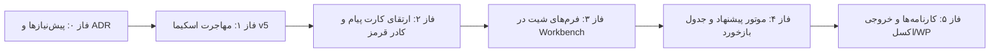

# سند جامع معماری: سامانه گزارش‌گیری یکپارچه و خودکفای EitaaBridge
## گذار به منبع یگانهٔ حقیقت (Single Source of Truth) با حفظ زیرساخت‌های پایدار

* **شناسهٔ سند:** `SPEC-2026-REPORTING-UNIFIED-V2`
* **نسخه:** `2.0.0`
* **تاریخ تدوین:** ۲۰۲۶-۱۰-۰۱ (۱۴۰۵/۰۷/۱۰)
* **وضعیت:** `PROPOSAL_V2 / REFINED_WITH_PEER_REVIEW / READY_FOR_3RD_MODEL_APPROVAL`
* **مرجع نسخه‌های پیشین:** نسخه ۱.۰.۰ و الحاقیه بازبینی تخصصی ثانویه (ZCode/GLM)

---

## ۱. تاریخچهٔ تدوین و سیر تکامل سند

| نسخه | تاریخ | شرح تغییرات |
|---|---|---|
| `1.0.0` | ۲۰۲۶-۱۰-۰۱ | تدوین اولیهٔ طرح چرخش از وردپرس/لاراگون به معماری یکپارچه EitaaBridge |
| `1.1.0` | ۲۰۲۶-۱۰-۰۱ | الحاقیهٔ بازبینی ثانویه (ZCode/GLM): هشدار درباره رویکرد میدان‌سبز، کشف دارایی‌های موجود مخزن و اصلاح هم‌زمانی/داده |
| `2.0.0` | ۲۰۲۶-۱۰-۰۱ | **نسخه تلفیقی و تکامل‌یافته جاری:** هم‌ترازی با کدهای واقعی مخزن، تثبیت اتصال ایتا، تبدیل وردپرس به آداپتور خروجی پرچم‌دار (نه حذف مخرب)، مدل دادهٔ هیبرید (Pydantic JSON + SQL Facts)، گارد ضدتکرار دومرحله‌ای، و برنامهٔ عملیاتی استقرار |

---

## ۲. خلاصهٔ مدیریتی و اصول راهبردی چرخش

این سند، معماری گذار سیستم از حالت «وابسته به پشتهٔ بیرونی وردپرس و لاراگون» به **«سامانهٔ گزارش‌گیری یکپارچه، بومی و خودکفا در EitaaBridge»** را تبیین می‌کند.

### تصمیمات کلیدی و تثبیت‌شده:
1. **ایتا بریج به عنوان منبع یگانه حقیقت (Single Source of Truth):** تمام جریان ثبت رویدادها، سنجه‌های عملکردی شیت‌ها، مدارک دستی و ارزیابی‌ها مستقیماً در هستهٔ دادهٔ EitaaBridge مدیریت می‌شوند.
2. **تثبیت و تداوم کامل اتصال به پیام‌رسان ایتا:** موتور اتصال، مدیریت نشست‌ها، دریافت و استخراج پیام‌ها از ایتا دست‌نخورده باقی مانده و شریان اصلی ورود داده است.
3. **تغییر رویکرد در قبال وردپرس (مستقل‌سازی به جای حذف مخرب):**
   * پایگاه داده و منطق فرم‌ها از وردپرس جدا می‌شود؛
   * اما پل وردپرس **حذف فیزیکی نمی‌شود**، بلکه به یک **آداپتور خروجی اختیاری با پرچم قابلیت (Feature Flag)** تبدیل می‌گردد تا آرشیو زنده (۴۸۹ رویداد و ۲۴۵۳ فایل) و جریان انتشار دوماهه محفوظ بماند.
4. **حاکمیت قطعی کاربر (Human-in-the-Loop):** موتورهای تحلیل متن و ایندکسرها صرفاً نقش «دستیار پیشنهاددهنده و پیش‌پرکنندهٔ فرم» را دارند؛ ثبت نهایی منحصراً با اقدام و تأیید کاربر انسانی انجام می‌شود.

---

## ۳. جدول هم‌ترازی دارایی‌های موجود در مخزن (Brownfield Asset Mapping)

بر خلاف فرضیات اولیهٔ میدان‌سبز، بخش عمده‌ای از زیرساخت مورد نیاز از قبل در مخزن ساخته شده و معماری جدید بر پایهٔ ارتقای آن‌ها بنا می‌شود:

| ردیف | مؤلفهٔ معماری | وضعیت واقعی در مخزن فعلی | برنامهٔ اقدام در نسخه ۲.۰ |
|---|---|---|---|
| ۱ | **لینک‌های وردپرس** | `reporting/store.py:2159` و کلاس `WpPostLink` | وردپرس از قبل در کد یک پروجکشن خروجی است؛ ساختار نگاشت `wp_post_id -> event_id` حفظ می‌شود. |
| ۲ | **پیوند پیام‌های ایتا** | فیلد `source_message_refs_json` در `event_candidates` و `reported_events` | نرمال‌سازی این فیلد به جدول مستقل `event_source_messages` همراه با اسکریپت migration داده‌های موجود. |
| ۳ | **اسکیمای فرم‌های شیت** | ماژول `reporting/forms.py` و دیکشنری `FORMS_BY_PROGRAM` | مرجع رسمی فیلدهای هر شیت همین تعاریف است و به جای ساخت تاکسونومی موازی، فرم‌ها از آن تغذیه می‌شوند. |
| ۴ | **رابط کاربری گزارش‌ها** | کامپوننت `ui/src/ReportingWorkbench.tsx` | این فایل از پیش وجود دارد؛ برنامه به جای بازنویسی، ارتقای این کامپوننت و اتصال آن به داک و پنل کناری است. |
| ۵ | **کارت نمایش پیام** | کامپوننت `ui/src/MessageContentCard.tsx` | ارتقای کارت پیام جهت نمایش برچسب پیشنهاد دستیار، کادر قرمز برای ثبت‌شده‌ها و دکمهٔ ویرایش. |
| ۶ | **تقویم و مناسبت‌ها** | موتور جلالی و کاتالوگ مناسبت‌ها در `reporting/indexer.py` و `metrics.py` | استفاده از ابزار نرمال‌سازی و دسته‌بندی مناسبت‌های موجود (`OccasionClass`). |

---

## ۴. مدل چندبُعدی داده و معماری پایگاه داده (Schema v5)

پایگاه داده در هستهٔ `ReportingStore` از نسخهٔ جاری ۴ به نسخهٔ ۵ ارتقا می‌یابد:

```text
                                   ┌───────────────────────┐
                                   │    reported_events    │
                                   │ (رویداد / خبر اصلی)   │
                                   └──────────┬────────────┘
                                              │
         ┌──────────────────┬─────────────────┼──────────────────┬──────────────────┐
         │ 1:N              │ 1:N             │ 1:N              │ 1:1              │ 1:N
         ▼                  ▼                 ▼                  ▼                  ▼
┌──────────────────┐ ┌──────────────┐ ┌───────────────┐ ┌──────────────────┐ ┌────────────────┐
│event_source_msgs │ │ event_facts  │ │event_documents│ │sheet_custom_data │ │ wp_post_links  │
│(پیام‌های ایتا)   │ │(سنجه مقایسه‌ای)│ │(مدارک و فایل) │ │(JSON فیلدهای شیت)│ │(خروجی وردپرس) │
└──────────────────┘ └──────────────┘ └───────────────┘ └──────────────────┘ └────────────────┘
```

### ۴.۱. الگوی ذخیره‌سازی دادهٔ هیبرید (Hybrid Schema Model)
برای ترکیب سرعت گزارش‌گیری تجمیعی با انعطاف‌پذیری فیلدهای متنوع هر شیت:
1. **فکت‌های عمومی و مقایسه‌پذیر (در جدول `event_facts`):**
   * سنجه‌های اصلی مانند `attendees_count` (تعداد مخاطبان)، `cost_amount` (هزینه مالی)، و شاخص‌های تجمیعی استانی به عنوان سطر رابطه در `event_facts` ذخیره می‌شوند تا کوئری‌های SUM و تجمیع‌های کاربرگ اکسل بدون افت کارایی و با سرعت بومی SQL اجرا شوند.
2. **فیلدهای اختصاصی و منعطف هر شیت (در فیلد `sheet_payload_json`):**
   * فیلدهای خاص (مثلاً: وضعیت محراب، امام جماعت شاغل/مدعو، رده سنی نومکلفان) بر اساس تعاریف Pydantic در قالب JSON ساختاریافته ذخیره می‌شوند. در SQLite از توابع بومی `json_extract` برای فیلتر و بازخوانی استفاده می‌شود.

### ۴.۲. گارد ضدتکرار دومرحله‌ای (Two-Tier Deduplication)

```text
[پیام ورودی ایتا]
       │
       ▼
 [بررسی گارد سطح ۱: قید ترکیبی سخت] ────(موجود است)───► [کادر قرمز قطعی در UI + قفل ثبت مجدد + دکمه ویرایش]
       │ (جدید است)
       ▼
 [بررسی گارد سطح ۲: هش متن نرمال‌شده] ──(مشابه است)───► [کادر زرد هشدار: احتمال پیام تکراری یا بازنشر در گروه دیگر]
       │ (بدون تشابه)
       ▼
 [پیام کاملاً جدید و آزاد برای ثبت]
```

1. **سطح اول (قید سخت فیزیکی):**
   * در جدول `event_source_messages` قید `UNIQUE(peer_id, message_id)` اعمال می‌شود.
   * *مسیر استثنای هدایت‌شده (Audit-Trailed Override):* چنانچه یک رویداد خاص دارای دو پوشش هم‌زمان در کاربرگ باشد (مثلاً یک پیام که هم‌زمان به دهه فجر و یک مسابقه اشاره دارد)، ثبت به شیت دوم تنها با تأیید صریح، درج دلیل متنی و ثبت شناسهٔ کاربر در لاگ ممیزی مجاز است.
2. **سطح دوم (سیگنال نرم‌افزاری متن مشابه):**
   * محاسبهٔ هش متن نرمال‌شده (`normalized_text_hash`). چنانچه همان خبر در کانال یا گروه دیگری بازنشر شده باشد (`peer_id` متفاوت)، سیستم در UI کادر زرد هشداردهنده نمایش می‌دهد، نه قفل سختگیرانه.
3. **مدیریت حالات خاص پیام (Edge Cases):**
   * **پیام ویرایش‌شده در ایتا:** شناسه پیام ثابت می‌ماند؛ در صورت بازخوانی، تاریخچه ویرایش ثبت می‌شود.
   * **پیام فورواردشده:** ثبت با شناسهٔ همان گروه جاری انجام می‌شود و شناسهٔ فرستندهٔ اصلی در متادیتا حفظ می‌گردد.
   * **پیام فقط‌رسانه (عکس/پوستر بدون کپشن):** توسط شناسه فایل/مدیا ردیابی می‌شود و کاربر می‌تواند مستقیماً به آن سنجه متصل کند.
   * **سیاست حذف پیام از ایتا (Tombstone):** حذف پیام در ایتا، رویداد ثبت‌شده در سامانه را پاک نمی‌کند؛ رکورد باقی می‌ماند و وضعیت پیوند به `source_detached` تغییر می‌یابد.

---

## ۵. طراحی موتور دستیار و حلقهٔ بازخورد یادگیری (Adaptive Rule Learning)

نیازی به یادگیری ماشین سنگین یا شبکه‌های عصبی پیچیده روی سیستم محلی نیست. موتور سبک بر پایهٔ جدول نگاشت بازخورد پیاده‌سازی می‌شود:

```sql
CREATE TABLE IF NOT EXISTS assistant_aliases (
    alias_id TEXT PRIMARY KEY,
    scope TEXT NOT NULL,                  -- 'unit', 'program', 'occasion'
    raw_normalized TEXT NOT NULL,         -- عبارت نرمال‌شده پیام
    target_id TEXT NOT NULL,              -- شناسه استاندارد مقصد
    confidence_weight REAL NOT NULL,      -- وزن انطباق
    source TEXT NOT NULL,                 -- 'system_rule', 'human_correction'
    hit_count INTEGER NOT NULL DEFAULT 0,
    created_at TEXT NOT NULL,
    updated_at TEXT NOT NULL
);
CREATE INDEX IF NOT EXISTS idx_aliases_lookup ON assistant_aliases(scope, raw_normalized);
```

### فرآیند در عمل:
1. **نرمال‌سازی سختگیرانهٔ نویسه‌های فارسی:** یکسان‌سازی خودکار حروف (ک/ی عربی به فارسی)، حذف اعراب، نیم‌فاصله‌زدایی، و تبدیل اعداد فارسی به انگلیسی.
2. **ثبت بازخورد کاربر:** هر بار که کاربر حدس سیستم (مثلاً تشخیص اشتباه نام شهرستان یا کد برنامه) را در فرم ویرایش می‌کند، یک رکورد با `source = 'human_correction'` و وزن بالا در این جدول ثبت می‌شود.
3. **اولویت‌بندی در استخراج‌های بعدی:** در تحلیل پیام‌های بعدی، نگاشت‌های انسانی بر قوانین عمومی پیش‌فرض سیستم تقدم قطعی خواهند داشت.

---

## ۶. تجربهٔ کاربری و رابط کاربری (UI/UX Specification)

### ۶.۱. میز کار گزارش‌ها (`ReportingWorkbench.tsx`)
این کامپوننت که از قبل در مخزن وجود دارد، گسترش یافته و در پنجرهٔ اصلی با قابلیت‌های زیر تجهیز می‌شود:
* **فرم چندبُعدی وابسته به شیت:** با انتخاب شیت (مثلاً شیت نماز یا شیت بازدید)، فیلدهای مربوطه از `form_definitions` لود می‌شوند.
* **پیش‌پر شدن خودکار (Smart Pre-fill):** به محض انتخاب یک یا چند پیام در چت، عنوان پیشنهادی، تاریخ استخراج‌شده، واحد قضایی و تخمین تعداد حضار در فرم قرار می‌گیرد.
* **پشتیبانی کامل از انتخاب چندپیامی (Multi-Select Grouping):** تجمیع متن و گالری تصاویر چندین پیام در یک کارت رویداد واحد.
* **ورود دستی مستقل:** امکان فشردن دکمه «ثبت گزارش بدون پیام ایتا» برای فعالیت‌های مستند اداری که در ایتا منتشر نشده‌اند.

### ۶.۲. تحول کارت پیام (`MessageContentCard.tsx`)
* **کادر قرمز برجسته:** برای تمام پیام‌هایی که در دیتابیس مشترک ثبت شده‌اند.
* **برچسب پیوند به خبر:** نمایش کد خبر و عنوان شیت بالای پیام.
* **دکمه‌های اقدام دوگانه:** 
  * پیام‌های جدید: دکمه «انتقال به فرم گزارش».
  * پیام‌های ثبت‌شده: دکمه «مشاهده و ویرایش گزارش».

---

## ۷. استقرار، مدیریت هم‌زمانی و پایداری (Concurrency & Operations)

### ۷.۱. معماری فرآیندها و اتصال به دیتابیس
* **مالکیت تک‌پروسه‌ای (Single-Process Daemon):**
  برای پیشگیری قطعی از تله‌های قفل دیتابیس و تضاد نشست‌ها (F-104 / V-240)، سرویس EitaaBridge به صورت یک Daemon واحد (FastAPI پشت Uvicorn) اجرا می‌شود. تمام درخواست‌های کاربران وب و کلاینت‌ها به این API متمرکز ارسال می‌گردد.
* **تنظیمات SQLite WAL:**
  * فعال‌سازی `PRAGMA journal_mode = WAL;`
  * تنظیم `PRAGMA busy_timeout = 30000;` (۳۰ ثانیه تاب‌آوری صف تراکنش‌ها).
  * `PRAGMA foreign_keys = ON;`
* **معماری Repository Pattern:** تمام تعاملات ذخیره‌سازی پشت یک اینترفیس انتزاعی قرار می‌گیرند تا در صورت ارتقای شبکه به بالای ۵۰ کاربر هم‌زمان، سوئیچ به PostgreSQL بدون تغییر کدهای دامنه میسر باشد.

### ۷.۲. استراتژی پشتیبان‌گیری و تاب‌آوری (Backup & RPO)
* **پشتیبان برخط شبانه:** اجرای خودکار فرمان امن `VACUUM INTO 'backups/reporting_backup_YYYYMMDD.db'` بدون قفل‌کردن خواندن/نوشتن سیستم.
* **سیاست RPO:** حداکثر زمان از دست رفتن داده در بدترین شرایط کمتر از ۲۴ ساعت خواهد بود.
* **لاگ تراکنش‌ها:** رویدادهای ایجاد و ویرایش گزارش‌ها در جدول ممیزی با ثبت نام کاربری (`created_by`) و مهر زمانی UTC ذخیره می‌شوند.

---

## ۸. نقشهٔ راه فازبندی اجرا (Detailed Phased Roadmap)



### فاز ۰: پیش‌نیازها، اسناد و مهار ریسک
* ثبت تصمیم معماری جدید در `ARCHITECTURE_DECISIONS.md`.
* طراحی اسکریپت بکاپ خودکار برخط.
* آماده‌سازی ابزار آزمون Contract برای لایه دیتابیس.

### فاز ۱: ارتقای هستهٔ ذخیره‌سازی داده (Data Layer v5)
* پیاده‌سازی جدول `event_source_messages` با قید `UNIQUE(peer_id, message_id)`.
* اسکریپت انتقال داده‌های فیلد `source_message_refs_json` موجود به جدول جدید.
* ایجاد جدول `assistant_aliases` برای نرمال‌سازی و بازخورد.
* ارتقای `REPORTING_SCHEMA_VERSION` به ۵ همراه با تست‌های Migration و Rollback.

### فاز ۲: تعامل بصری چت و گارد ضدتکرار (Chat UI & Guard)
* اتصال API وضعیت ثبت پیام‌ها (`/api/v1/reporting/messages/status`).
* ارتقای `MessageContentCard.tsx`: اعمال استایل کادر قرمز، برچسب‌های وضعیت، و مهار ثبت مجدد.
* افزودن چک‌باکس انتخاب گروهی پیام‌ها برای ادغام در یک گزارش.

### فاز ۳: تکمیل و یکپارچه‌سازی میز کار گزارش‌ها (Reporting Workbench)
* ارتقای `ReportingWorkbench.tsx` بر مبنای `form_definitions`.
* پیاده‌سازی ثبت دستی بدون پیام ایتا.
* پیاده‌سازی حالت «ویرایش گزارش موجود» در صورت انتخاب پیام ثبت‌شده.

### فاز ۴: فعال‌سازی دستیار هوشمند و یادگیری تعاملی
* فعال‌سازی ماژول فیلتر نیت پیام (`event_report` vs `informational` vs `promotional`).
* اتصال پیشنهادهای استخراج‌شده به عنوان مقادیر پیش‌فرض (Pre-fill) در فرم Workbench.
* ذخیره تصحیحات کاربر در جدول `assistant_aliases` جهت یادگیری بدون شبکه عصبی.

### فاز ۵: موتور کارنامه‌ها، گزارش‌های تجمیعی و تثبیت آداپتور وردپرس
* تولید خودکار خروجی اکسل استاندارد برای شیت نماز و کاربرگ بازدید بر مبنای دیتابیس بومی.
* بازطراحی ارسال به وردپرس به عنوان یک اقدام اختیاری (خروجی مجزا) با Feature Flag، بدون شکستن لینک‌های گذشته.

---

## ۹. چک‌لیست اعتبارسنجی برای مدل ارزیاب سوم (Criteria for 3rd LLM Evaluation)

از مدل ارزیاب سوم تقاضا می‌شود این سند را به صورت ویژه بر اساس ۴ محور زیر سنجش و تأیید نماید:

1. **انطباق بر واقعیت مخزن (Brownfield Soundness):** آیا سند موفق شده است فرضیات اشتباه میدان‌سبز را پاک کرده و برنامه را بر دارایی‌های واقعی موجود (`ReportingStore`, `form_definitions`, `ReportingWorkbench`, `WpPostLink`) استوار سازد؟
2. **استحکام گارد ضدتکرار و استثنائات (Deduplication Rigor):** آیا تفکیک گارد سخت `(peer_id, message_id)` از هشدار شباهت متنی، و تعریف مسیر استثنای ممیزی‌شده، سناریوهای واقعی کاربری را پوشش می‌دهد؟
3. **کارایی مدل دادهٔ هیبرید (Hybrid Schema Efficiency):** آیا ترکیب فکت‌های عمومی SQL (`event_facts`) با ساختار JSON فرم‌های هر شیت، بهترین موازنه را میان سرعت گزارش‌گیری تجمیعی و سهولت توسعه فرم‌ها برقرار کرده است؟
4. **ایمنی عملیاتی و استقرار (Operational Safety & Concurrency):** آیا پیش‌شرط مالکیت تک‌پروسه‌ای بر SQLite WAL، خطر تداخل نشست‌های ایتا و بن‌بست‌های پایگاه داده را به صفر می‌رساند؟
