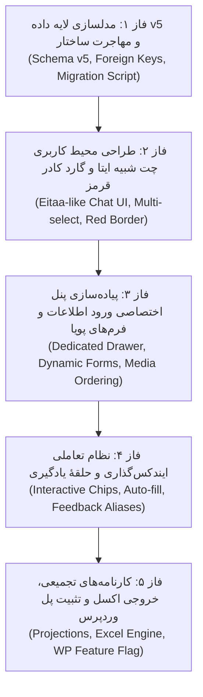

# سند جامع معماری و طراحی تفصیلی: سامانه گزارش‌گیری یکپارچه EitaaBridge
## نسخهٔ نهایی برای تصویب (Final Architectural Blueprint) — تمرکز بر تجربهٔ کاربری شبیه ایتا (Mobile-First)، پنل اختصاصی ورود اطلاعات و نظام پیشرفتهٔ ایندکس‌گذاری

* **شناسهٔ سند:** `SPEC-2026-REPORTING-UNIFIED-V3`
* **نسخه:** `3.0.0`
* **تاریخ تدوین:** ۲۰۲۶-۱۰-۰۱ (۱۴۰۵/۰۷/۱۰)
* **وضعیت:** `FINAL_PROPOSAL / READY_FOR_FINAL_PEER_APPROVAL`
* **مرجع نسخه‌های پیشین:** نسخه ۱.۰.۰، الحاقیه بازبینی تخصصی ثانویه (ZCode/GLM) و نسخه ۲.۰.۰

---

## ۱. پیش‌درآمد و انگیزهٔ نگارش نسخه ۳.۰

در ادامهٔ بازبینی‌های فنی و پس از بررسی تجربهٔ عملیاتی ثبت اطلاعات، نسخهٔ ۳.۰ با هدف پاسخ به ۳ دغدغهٔ اساسی تکامل یافته است:

1. **انطباق حداکثری با تجربهٔ کاربری پیام‌رسان ایتا (به‌ویژه در گوشی تلفن همراه):**
   کاربر نباید احساس کند وارد یک نرم‌افزار پیچیده یا سنگین شده است. محیط اصلی پیام‌ها، ناوبری، انتخاب پیام‌ها و اکشن‌ها باید تا حد ممکن حس آشنا، سبک و روان پیام‌رسان ایتا را القا کند.
2. **تثبیت رویکرد «پنل اختصاصی ورود اطلاعات» متناسب با هر شیت:**
   همان‌گونه که در تجربهٔ موفق گذشته، ثبت مطلب نیازمند یک پنل متمرکز برای تنظیم عنوان، عکس‌ها و نگاشت بود، در سیستم جدید نیز فشرده‌سازی فرم‌های متنوع در ستون‌های کوچک رد شده و یک **«پنل/کشوی اختصاصی پویا (Dedicated Sheet Drawer / Bottom Sheet)»** طراحی شده که بسته به اینکه پیام به کدام «برنامه اصلی / شیت» تعلق دارد، فرم ورودی مربوطه را با فیلدهای ویژهٔ خود باز می‌کند.
3. **ارتقای ساختار ایندکس‌گذاری و تعامل سریع کاربر در اصلاح آن:**
   سیستم پیشنهاد هوشمند تگ‌ها و کدهای برنامه‌ها باید بصری و سبک باشد (در قالب نشان‌ها و چیپ‌های تعاملی) و کاربر بتواند با یک لمس/کلیک، ایندکس اشتباه را حذف و ایندکس صحیح را از لیست پیشنهادی جایگزین کند؛ این اصلاح دستی، مستقیماً الگوریتم وزن‌دهی محلی را برای دفعات بعد ارتقا می‌دهد.

---

## ۲. خلاصهٔ تغییرات بنیادین معماری (The Core Pivot)

```text
معماری قدیمی (ناهمگون و سنگین):
[ایتا] ──► [EitaaBridge (کش محلی)] ──► [پل ارتباطی API] ──► [لاراگون + PHP + MySQL] ──► [قالب و فرم‌های وردپرس]

معماری نهایی v3.0 (بومی، سبک و یکپارچه):
[ایتا] ──► [EitaaBridge هسته متمرکز (FastAPI + SQLite WAL)] ◄──► [فرانت‌اند واکنش‌گرا (شبیه ایتا در وب/موبایل)]
             │
             ├──► منبع یگانه حقیقت: فرم‌های شیت، فکت‌ها، مدارک دستی، گارد ضدتکرار
             ├──► دستیار هوشمند محلی و حلقهٔ یادگیری بازخورد (Assistant Aliases)
             └──► [خروجی اختیاری با پرچم قابلیت (Feature Flag)] ──► [وردپرس (حفظ آرشیو شواهد گذشته)]
```

* **اتصال به پیام‌رسان ایتا:** با تمام قابلیت‌ها در هسته باقی می‌ماند و مدخل اصلی دریافت اطلاعات است.
* **وردپرس:** از نقش «مخزن اجباری داده» خارج شده و به یک «آداپتور خروجی اختیاری» تبدیل می‌شود تا هیچ کدی حذف مخرب نشود و شواهد گذشته محفوظ بماند.

---

## ۳. طراحی تجربهٔ کاربری: محیط کاربری شبیه ایتا (Mobile-First UX)

### ۳.۱. محیط اصلی گفتگو و انتخاب پیام‌ها (Chat Surface)
* **چیدمان بومی و ساده:** محیط نمایش پیام‌ها، حباب‌های گفتگو، نمایش تاریخ شمسی، جداکنندهٔ روزها و وضعیت تیک پیام‌ها کاملاً منطبق بر سبک تلگرام/ایتا پیاده‌سازی می‌شود.
* **انتخاب پیام (Selection Flow):**
  * در موبایل با لمس طولانی (Long-press) یا لمس روی پیام، حالت انتخاب فعال می‌شود.
  * نوار بالای صفحه به «نوار انتخاب» تبدیل می‌شود: *«۲ پیام انتخاب شد»* همراه با دکمه‌های لغو و گزینه‌ها.
  * در پایین صفحه، یک نوار شناور ظاهر می‌شود با دکمهٔ برجسته: **«ثبت در گزارش (با آیکون گزارش)»**.
* **کادر قرمز و شناسهٔ بصری ثبت:**
  * پیام‌هایی که قبلاً در هر گزارشی ثبت شده‌اند، در همان نگاه اول دارای **کادر قرمز شفاف و بج اختصاصی «ثبت‌شده در رویداد #کد»** هستند.
  * با انتخاب این پیام‌ها، دکمهٔ پایین به جای «ثبت جدید» به **«مشاهده و ویرایش گزارش مرتبط»** تغییر می‌یابد.

---

## ۴. معماری پنل اختصاصی ورود اطلاعات (Dedicated Reporting Drawer)

به جای پراکنده‌کردن فیلدها در گوشه‌وکنار رابط، با لمس دکمهٔ «ثبت در گزارش»، یک **پنل اختصاصی متمرکز** باز می‌شود:
* در **تلفن همراه:** به صورت **Bottom Sheet (کشوی متحرک از پایین به بالا)** با قابلیت اسکرول نرم و امکان بستن با کشیدن به پایین.
* در **دسکتاپ:** به صورت **Slide-Over Panel (پنل کشویی پهن و شیک از سمت راست)** که هم‌زمان چت را نیز در دید کاربر نگه می‌دارد.

```text
┌─────────────────────────────────────────────────────────────┐
│ ◄ بازگشت / انصراف           ثبت گزارش در کارنامه        [ذخیره] │
├─────────────────────────────────────────────────────────────┤
│ 📌 سرفصل / برنامهٔ اصلی:                                    │
│ [ انتخاب خودکار: شیت نماز > ریزبرنامه: جشن نومکلفان   ▼ ]   │
├─────────────────────────────────────────────────────────────┤
│ 🖼️ رسانه‌ها و ترتیب تصاویر:                                  │
│ [ [عکس ۱ (شاخص)]  [عکس ۲]  [عکس ۳]  [+ افزودن عکس دستی] ]  │
│ * امکان کشیدن و رها کردن (Drag & Drop) برای تغییر ترتیب عکس‌ها│
├─────────────────────────────────────────────────────────────┤
│ 📝 اطلاعات پایه رویداد:                                     │
│ عنوان: [ جشن تکلیف دانش‌آموزان حوزه قضایی بابل             ]│
│ واحد مجری: [ دادگستری شهرستان بابل                   ▼ ]   │
│ تاریخ اجرا: [ ۱۴۰۵/۰۷/۱۰ (تقویم جلالی)               📅 ]   │
├─────────────────────────────────────────────────────────────┤
│ 📋 فیلدهای تخصصی شیت انتخابی (Dynamic Form Fields):        │
│ (این بخش دقیقاً بر اساس برنامهٔ انتخاب‌شده تغییر می‌کند)      │
│ تعداد نومکلفان: [ ۴۵  ]       تعداد امام جماعت: [ ۱   ]     │
│ هدیه اهدا شد؟ [x] بله  [ ] خیر     مبلغ کل هدایا: [ ۱۲,۰۰۰,۰۰۰ ]│
├─────────────────────────────────────────────────────────────┤
│ 🏷️ ایندکس‌ها، کلمات کلیدی و مناسبت‌ها (Smart Interactive Chips):│
│ مناسبت: ( میلاد امام رضا (ع) ❌ )  ( دهه کرامت ❌ )  [+ افزودن] │
│ تگ‌های محتوایی: ( #ترویج_نماز ❌ ) ( #فرهنگی ❌ )             │
├─────────────────────────────────────────────────────────────┤
│ [ ثبت نهایی و صدور در کارنامه ]        [ ذخیره به عنوان پیش‌نویس ] │
└─────────────────────────────────────────────────────────────┘
```

### ۴.۱. ویژگی‌های بارز این پنل:
1. **پویایی کامل فرم بر اساس سرفصل (Form Polymorphism):** 
   اگر سرفصل «شیت نماز» انتخاب شود، فیلدهای ائمه جماعت و نمازخانه ظاهر می‌شوند. اگر سرفصل «مسابقات قرآن» باشد، فیلدهای رده مسابقات و تعداد برگزیدگان بارگذاری می‌شوند. تمام ساختار از `form_definitions` در بک‌اند خوانده می‌شود.
2. **مدیریت ترتیب تصاویر و کپشن:** 
   کاربر می‌تواند عکس شاخص (Cover Photo) را مشخص کرده، ترتیب آلبوم را تغییر داده یا تصویر جدیدی از حافظهٔ دستگاه ضمیمه کند.
3. **پیش‌پر شدن هوشمند (Auto Pre-fill):** 
   عنوان، واحد سازمانی، تاریخ و مقادیر عددی پیش از باز شدن پنل، توسط موتور تحلیل محتوا تخمین زده شده و در فیلدها آمادهٔ تأیید یا ویرایش هستند.

---

## ۵. نظام نوین ایندکس‌گذاری و فرآیند اصلاح تعاملی (Interactive Indexing System)

در معماری وردپرس، دسته‌بندی‌ها و برچسب‌ها ساختاری خشک داشتند. در معماری جدید، ایندکس‌گذاری بر پایهٔ **«مدل تعاملی نشان‌ها (Interactive Chips)»** و **«حلقهٔ بازخورد سریع»** بازطراحی می‌شود:

### ۵.۱. تجربهٔ کاربری اصلاح ایندکس (User Tag Override Flow)
* **نمایش بصری:** ایندکس‌های پیشنهادی سیستم با یک آیکون جرقه هوشمند (`✦`) در کنار خود مشخص می‌شوند.
* **حذف سریع:** اگر سیستم موضوعی را به اشتباه تشخیص داده باشد، کاربر با یک تپ/کلیک روی علامت ضربدر (`❌`) آن تگ را حذف می‌کند.
* **افزودن و جایگزینی با جستجوی سریع:** با زدن دکمهٔ `+`، کادر جستجوی پیش‌بینی‌کننده (Auto-complete) باز می‌شود و با تایپ ۲ حرف، فهرست کدهای رسمی و عناوین مناسبتی فیلتر و با یک لمس اضافه می‌شوند.

### ۵.۲. سازوکار یادگیری بازخورد بدون شبکه عصبی (Feedback Learning Engine)
هر بار که کاربر در این پنل یک ایندکس یا واحد را تغییر دهد، جدول `assistant_aliases` در هسته به‌روزرسانی می‌شود:
1. **نرمال‌سازی متن مبدأ:** متن پیام با تابع سختگیرانهٔ نویسه‌های فارسی (اصلاح ک/ی، حذف تنوین و اعراب، یکپارچه‌سازی اعداد) تمیز می‌شود.
2. **ثبت بازخورد انسانی:** نگاشت بین اصطلاح استخراج‌شده و مقدار انتخابی نهایی کاربر با برچسب `source = 'human_correction'` و ضریب اطمینان `1.0` ثبت یا تقویت می‌شود.
3. **اولویت در پردازش‌های بعدی:** در دفعات بعد، سیستم ابتدا این جدول بازخوردهای انسانی را بررسی می‌کند؛ بنابراین برای پیام‌های مشابه از همان حوزهٔ قضایی، دیگر خطایی رخ نخواهد داد.

---

## ۶. مدل ذخیره‌سازی داده (Database Schema v5)

مدل داده به صورت **هیبرید (ترکیبی از فکت‌های تجمیعی و جزئیات ساختاریافته)** در هستهٔ `ReportingStore` پیاده می‌شود:

```sql
-- ۱. جدول اصلی رویدادها و اخبار
CREATE TABLE IF NOT EXISTS reported_events (
    event_id TEXT PRIMARY KEY,
    section_id TEXT NOT NULL,              -- 'prayer', 'inspection_visit', 'quran'
    sub_program_code TEXT NOT NULL,        -- کد ریزبرنامه (مثلاً '80402')
    unit_id TEXT NOT NULL,                 -- حوزه قضایی مجری
    occurred_on TEXT NOT NULL,             -- تاریخ وقوع (جلالی/میلادی)
    occasion_class TEXT,                   -- مناسبت مذهبی/انقلابی
    title TEXT NOT NULL,
    description TEXT,
    sheet_payload_json TEXT NOT NULL,      -- فیلدهای اختصاصی شیت با اعتبارسنجی Pydantic
    created_by TEXT NOT NULL,              -- نام کاربر ثبت‌کننده
    created_at TEXT NOT NULL,
    updated_at TEXT NOT NULL
);

-- ۲. جدول پیوند پیام‌های ایتا و گارد سخت ضدتکرار
CREATE TABLE IF NOT EXISTS event_source_messages (
    id INTEGER PRIMARY KEY AUTOINCREMENT,
    event_id TEXT NOT NULL REFERENCES reported_events(event_id) ON DELETE CASCADE,
    peer_id INTEGER NOT NULL,              -- شناسه کانال یا گروه در ایتا
    message_id INTEGER NOT NULL,           -- شماره پیام در چت
    dialog_label TEXT,                     -- نام گروه/کانال
    normalized_hash TEXT,                  -- هش متن نرمال‌شده جهت هشدار شباهت
    linked_at TEXT NOT NULL,
    linked_by TEXT NOT NULL,
    is_audit_override INTEGER NOT NULL DEFAULT 0, -- پرچم ثبت استثنایی
    override_reason TEXT,                  -- دلیل توجیهی ثبت مجدد
    UNIQUE(peer_id, message_id)            -- گارد قطعی عدم ثبت تکراری پیام
);
CREATE INDEX IF NOT EXISTS idx_source_msg_lookup ON event_source_messages(peer_id, message_id);

-- ۳. جدول فکت‌ها و سنجه‌های عددی عمومی (جهت محاسبات سریع اکسل و کارنامه‌ها)
CREATE TABLE IF NOT EXISTS event_facts (
    fact_id TEXT PRIMARY KEY,
    event_id TEXT NOT NULL REFERENCES reported_events(event_id) ON DELETE CASCADE,
    metric_key TEXT NOT NULL,              -- 'attendees_count', 'cost_amount', 'imams_count'
    metric_value REAL NOT NULL,
    unit_of_measure TEXT NOT NULL DEFAULT 'count',
    recorded_at TEXT NOT NULL
);
CREATE INDEX IF NOT EXISTS idx_facts_metric ON event_facts(metric_key);

-- ۴. جدول پیوند اسناد و رسانه‌ها (عکس، فاکتور، بخشنامه)
CREATE TABLE IF NOT EXISTS event_documents (
    doc_id TEXT PRIMARY KEY,
    event_id TEXT NOT NULL REFERENCES reported_events(event_id) ON DELETE CASCADE,
    doc_type TEXT NOT NULL,                -- 'cover_photo', 'album_photo', 'financial_receipt'
    storage_path TEXT NOT NULL,            -- مسیر فایل محلی یا هش رسانه
    display_order INTEGER NOT NULL DEFAULT 0,
    caption TEXT,
    created_at TEXT NOT NULL
);

-- ۵. جدول نگاشت و یادگیری بازخوردها (Adaptive Aliases)
CREATE TABLE IF NOT EXISTS assistant_aliases (
    alias_id TEXT PRIMARY KEY,
    scope TEXT NOT NULL,                   -- 'unit', 'program', 'occasion'
    raw_normalized TEXT NOT NULL,          -- عبارت نرمال‌شده پیام
    target_id TEXT NOT NULL,               -- شناسه مرجع سیستم
    confidence_weight REAL NOT NULL DEFAULT 1.0,
    source TEXT NOT NULL,                  -- 'system_rule', 'human_correction'
    hit_count INTEGER NOT NULL DEFAULT 1,
    updated_at TEXT NOT NULL
);
CREATE INDEX IF NOT EXISTS idx_alias_search ON assistant_aliases(scope, raw_normalized);
```

---

## ۷. استقرار، مدیریت هم‌زمانی و پایداری (Concurrency & Operations)

1. **انحصار تک‌پروسه‌ای (Single-Process Daemon):**
   سرویس بک‌اند EitaaBridge منحصراً به صورت یک پروسهٔ متمرکز بر روی سرور یا رایانهٔ اصلی اجرا می‌شود و کلاینت‌ها (چه تحت وب و چه برنامه محلی) به این سرویس متصل می‌شوند. بدین ترتیب خطر تداخل هم‌زمانی نشست‌های ایتا و قفل‌های دیتابیس به صفر می‌رسد.
2. **پیکربندی پایگاه داده:** 
   حالت `WAL` با زمان انتظار `busy_timeout = 30000ms` فعال بوده و کلیه عملیات خواندن و نوشتن از طریق صف تراکنشی امن انجام می‌پذیرد.
3. **پشتیبان‌گیری خودکار بدون قفل (Zero-Downtime Backup):**
   هر شب رأس ساعت معین، دستور `VACUUM INTO 'backups/backup_YYYYMMDD.db'` به طور نامحسوس و بدون کوچک‌ترین وقفه در کار کاربران، نسخهٔ پشتیبان سالم و کاملی ایجاد می‌کند.

---

## ۸. نقشهٔ راه فازبندی توسعه و استقرار (Strengthened Implementation Roadmap)



### فاز ۱: مدلسازی لایه داده v5 و مهاجرت ساختار
* **هدف:** تضمین یکپارچگی داده‌ها و تثبیت قیدهای عدم تکرار در دیتابیس.
* **اقدامات اجرایی:**
  1. افزودن جداول ۵گانه بالا در `ReportingStore`.
  2. تدوین اسکریپت migration برای انتقال داده‌های موجود در `source_message_refs_json` به جدول `event_source_messages`.
  3. نگارش تست‌های اعتبارسنجی و تست بازگشت (Rollback Test) در صورت خطا.
* **دروازهٔ پذیرش (Acceptance Gate):** پاس شدن ۱۰۰٪ تست‌های واحد لایه داده در پایتون با قید یکتایی پیام.

### فاز ۲: محیط کاربری چت شبیه ایتا و گارد کادر قرمز (Frontend Chat UI)
* **هدف:** ساده‌سازی تعاملات و القای حس پیام‌رسان ایتا در موبایل و دسکتاپ.
* **اقدامات اجرایی:**
  1. یکپارچه‌سازی رابط حباب پیام‌ها در `MessageContentCard.tsx`.
  2. اعمال کادر قرمز قطعی برای پیام‌های دارای رکورد در دیتابیس مشترک.
  3. افزودن حالت انتخاب چندپیامی (Multi-select) با نوار اکشن شناور در پایین صفحه.
* **دروازهٔ پذیرش:** نمایش درست کادر قرمز برای پیام‌های ثبت‌شده در تست رابط کاربری، و امکان انتخاب هم‌زمان چند پیام در مرورگر موبایل.

### فاز ۳: پنل اختصاصی ورود اطلاعات شیت‌ها (Dedicated Sheet Drawer)
* **هدف:** انتقال تجربهٔ ورود داده به یک کشوی مدرن، تمیز و واکنش‌گرا بدون فشردگی ستونی.
* **اقدامات اجرایی:**
  1. توسعهٔ کامپوننت `ReportingSheetDrawer` (به صورت Bottom-sheet در موبایل و Side-drawer در دسکتاپ).
  2. رندرینگ داینامیک فیلدهای فرم بر اساس برنامهٔ انتخابی با اتکا به `form_definitions`.
  3. ابزار مرتب‌سازی تصاویر پیوست (انتخاب عکس شاخص و حذف عکس نامرتبط).
* **دروازهٔ پذیرش:** باز شدن روان فرم متناسب با شیت انتخابی، ذخیره موفق رویداد و ثبت فکت‌ها در پایگاه داده.

### فاز ۴: نظام تعاملی ایندکس‌گذاری و حلقهٔ بازخورد (Smart Indexing & Feedback)
* **هدف:** تسریع فرآیند دسته‌بندی و بالا بردن هوشمندی سیستم از طریق اصلاحات انسانی.
* **اقدامات اجرایی:**
  1. پیاده‌سازی کامپوننت نشان‌های تعاملی تگ‌ها (Chips) با قابلیت حذف ۱-کلیکه (`❌`) و افزودن سریع با Autocomplete.
  2. اتصال موتور تحلیل نیت پیام (`event_report` vs `informational`) برای پر کردن خودکار فیلدهای اولیه.
  3. فعال‌سازی ذخیره‌سازی تغییرات دستی در جدول `assistant_aliases` جهت یادگیری دائمی.
* **دروازهٔ پذیرش:** تأیید یادگیری سیستم؛ ثبت یک اصطلاح دستی جدید توسط کاربر باید در پیام بعدی مشابه، مستقیماً به عنوان پیشنهاد اول نشان داده شود.

### فاز ۵: موتور کارنامه‌ها، خروجی اکسل و تثبیت نهایی پل وردپرس
* **هدف:** تولید گزارش‌های رسمی سازمان و تثبیت همزیستی با وردپرس بدون ریسک شکست شواهد.
* **اقدامات اجرایی:**
  1. ساخت ماژول تجمیع داده‌ها برای ستون‌های شیت نماز و کاربرگ ارزیابی عملکرد استانی.
  2. موتور صدور فایل اکسل استاندارد منطبق با فرمت بخشنامه‌ای.
  3. بازتنظیم ماژول وردپرس به عنوان یک اقدام جانبی اختیاری با کلید پرچم (`feature_flag: enable_wordpress_sync = false/true`).
* **دروازهٔ پذیرش:** تولید موفق فایل اکسل با فرمت رسمی، و ارسال آزمایشی موفق به وردپرس در صورت روشن بودن پرچم قابلیت.

---

## ۹. چک‌لیست اعتبارسنجی نهایی برای مدل ارزیاب (3rd LLM Approval Criteria)

از همکار ارزیاب (مدل سوم) تقاضا می‌شود این سند را به صورت ویژه با محورهای زیر بسنجد و نظر خود را اعلام فرماید:

1. **ارزیابی رویکرد پنل اختصاصی (Dedicated Drawer):** آیا انتخاب Bottom-sheet/Side-drawer پویا بر اساس برنامه اصلی، چالش پیچیدگی و تنوع فیلدهای شیت‌ها را در موبایل و دسکتاپ حل کرده است؟
2. **ارزیابی نظام ایندکس‌گذاری تعاملی (Chips & Feedback):** آیا الگوی چیپ‌های تعاملی همراه با جدول نگاشت بازخورد سبک (`assistant_aliases`)، راه‌حلی ارگونومیک، سریع و کم‌هزینه برای طبقه‌بندی محتوا بدون نیاز به زیرساخت هوش مصنوعی سنگین فراهم آورده است؟
3. **توازن میان حفظ گذشته و استقلال آینده:** آیا تبدیل وردپرس به آداپتور پرچم‌دار در کنار منبع یگانه حقیقت قرار گرفتن EitaaBridge، ریسک از دست رفتن داده‌ها و شواهد گذشته را به صفر رسانده است؟
4. **قابلیت اجرای فازبندی:** آیا ترتیب فازهای ۵گانه منطقی، کم‌ریسک و دارای مرزهای اعتبارسنجی شفاف و قابل آزمون هست؟

---

## ۱۰. بازبینی پایانی مدل سوم (Final Peer Review — ZCode/GLM)

* **بازبین:** ZCode (GLM) — مطالعهٔ سند نسخهٔ ۳.۰.۰، مقایسه با کد واقعی مخزن و الحاقیهٔ بازبینی ثانویهٔ نسخهٔ ۱.
* **تاریخ:** ۲۰۲۶-۱۰-۰۱
* **حکم نهایی: تأیید مشروط (Conditional Approval).** بازخوردهای بخش ۱۰ نسخهٔ ۱ به‌درستی اعمال شده‌اند؛ چهار مورد باقی‌مانده در ۱۰.۲ باید پیش از آغاز فاز ۱ روشن شود. هر چهار مورد «اصلاح سند» هستند، نه تغییر جهت معماری.

### ۱۰.۱. تأیید اعمال بازخوردهای نسخهٔ پیشین

مورد به مورد در برابر کد واقعی سنجیده شد و همگی سالم اعمال شده‌اند:

1. چرخش «حذف» به «آداپتور خروجی پرچم‌دار» وردپرس (بخش ۲ و فاز ۵).
2. مهاجرت `source_message_refs_json` به جدول `event_source_messages` در فاز ۱ — منطبق با واقعیت کد (`reporting/store.py:127`).
3. `form_definitions` به‌عنوان منبع فرم پویا (بخش ۴.۱ و فاز ۳) — موجود در `reporting/store.py`.
4. مدل ذخیرهٔ ترکیبی `sheet_payload_json` + `event_facts` (بخش ۶).
5. جدول `assistant_aliases` با نرمال‌سازی فارسی، `source='human_correction'` و وزن اطمینان (بخش ۵.۲).
6. سیگنال دوم شباهت با `normalized_hash` (بخش ۶).
7. حذف ارجاع نادرست `Composer.tsx`؛ فاز ۲ اکنون بر `MessageContentCard.tsx` موجود استوار است.
8. تک‌پروسه‌ای‌سازی، `WAL`/`busy_timeout` و پشتیبان شبانهٔ `VACUUM INTO` (بخش ۷).

### ۱۰.۲. موارد باقی‌مانده پیش از تصویب نهایی (Must-Fix)

**۱) تناقض ساختاری گارد ضدتکرار با ثبت استثنایی (مهم‌ترین مورد):** در بخش ۶، قید `UNIQUE(peer_id, message_id)` پیوند دومِ همان پیام به رویداد دیگر را در سطح پایگاه داده ناممکن می‌کند، در حالی که ستون‌های `is_audit_override` و `override_reason` فرض می‌کنند چنین پیوندی ثبت‌پذیر است؛ این دو با هم ناسازگارند. راه‌حل پیشنهادی: پیوندِ واحد را در پایگاه داده قطعی نگه دار و «ثبت استثنایی» را نه به‌صورت ردیف دوم، بلکه به‌صورت **جابه‌جایی پیوند در یک تراکنش** (حذف پیوند قدیمی + درج پیوند جدید همراه با `override_reason`) یا «ویرایش رویداد موجود» پیاده کن؛ بدین ترتیب یکپارچگی جدول می‌ماند و توجیه نیز ثبت می‌شود.

**۲) رگرسیون فکت‌ها نسبت به نسخهٔ ۱:** نسخهٔ ۱ برای `event_facts` دو ستون `numeric_value` و `text_value` و ستون منبع (`value_source`) داشت؛ در نسخهٔ ۳ به `metric_value REAL NOT NULL` تقلیل یافته و `value_source` حذف شده است. اگر تصمیم این است که فکت‌های متنی (مانند نام امام جماعت) صرفاً در `sheet_payload_json` بمانند، این را صریحاً بنویس؛ و برای حسابرسیِ مقادیر پیش‌پرشدهٔ دستیار، `value_source` (یا معادل آن در payload) حفظ شود.

**۳) احراز هویت و امنیت در بخش ۷ جا افتاده:** ستون‌های `created_by` و `linked_by` فقط با ورود تک‌کاربر واقعی معنا پیدا می‌کنند (مدل اعتماد LAN فعلی کافی نیست) و مسیر اینترنت فقط پشت VPN/TLS باز شود. علاوه بر آن: رمز و توکن در `.env` قرار نگیرد (تلهٔ F-102) و شناسهٔ حساس در لاگ ثبت نشود.

**۴) حاکمیت اسناد:** این چرخش پیش از فاز ۱ باید به‌صورت ADR در `ARCHITECTURE_DECISIONS.md` ثبت شود؛ هر فاز با دروازه‌های کیفیت AGENTS.md (آزمون پایتون، `ui run check`، checker حافظه) بسته و در `VALIDATION_LEDGER.md` ثبت گردد. دروازهٔ پذیرش فاز ۵ («ارسال آزمایشی موفق به وردپرس») چون انتشار واقعی است، نیازمند تأیید همان‌لحظه‌ای کاربر مطابق AGENTS.md است.

### ۱۰.۳. موارد تکمیلی کوچک (پیش از فاز ۵ الزامی است، مانع فاز ۱ نیست)

* تکلیف آرشیو موجود وردپرس صریح شود؛ پیشنهاد: «آرشیو ۴۸۹ رویداد و ۲۴۵۳ فایل فقط-خواندنی در WP می‌ماند و پیوندهای پست موجود در `ReportingStore` زیر همان پرچم حفظ می‌شوند؛ ورود دادهٔ قدیمی به فروشگاه جدید در دستور کار نیست». در صورت تصمیم متفاوت به ETL، جدول نگاشت `wp_post_id → event_id` به فاز ۵ اضافه گردد.
* رسانه به‌صورت هش‌محور (sha256، تک‌نسخه) ذخیره شود و الگوریتم `normalized_hash` تعریف گردد (sha256 از متن نرمال‌شده؛ برای پیامِ فقط‌رسانه، هش فایل). سیاست پیام‌های فورواردشده، ویرایش‌شده در مبدأ و حذف‌شده از مبدأ (tombstone) در یک بند کوتاه تعریف شود.
* تاریخ‌ها و دوره‌ها از موتور تقویم جلالی موجود پرتال تغذیه شوند، نه پیاده‌سازی موازی.
* علاوه بر پشتیبان شبانه، RPO مشخص و یک رزمایش بازیابیِ یک‌باره تعریف شود.

### ۱۰.۴. پاسخ به چهار محور پرسش بخش ۹

1. **پنل اختصاصی (Drawer):** بله — الگوی Bottom-sheet در موبایل و Slide-over در دسکتاپ با فرم پویا از `form_definitions` پاسخ درست به تنوع فیلدهاست؛ فقط مطابق بند ۱۰.۲-۲ تکلیف فکت متنی روشن شود.
2. **ایندکس‌گذاری تعاملی (Chips + Aliases):** بله — سبک، قابل حسابرسی و بدون زیرساخت سنگین؛ سازگار با اصل انسان در حلقه.
3. **توازن حفظ گذشته و استقلال آینده:** در صورت صراحت بند ۱۰.۳ دربارهٔ آرشیو، بله؛ نگارش فعلی در این بند مبهم است.
4. **قابلیت اجرای فازبندی:** بله — ترتیب فازها و دروازه‌های پذیرش منطقی و آزمون‌پذیر است؛ فقط موارد ۱۰.۲-۳ و ۱۰.۲-۴ به دروازه‌های مربوطه اضافه شود.

### ۱۰.۵. جمع‌بندی

با اعمال چهار مورد ۱۰.۲ (که همگی اصلاح نگارشی/ساختاری سند هستند و جهت معماری را تغییر نمی‌دهند)، سند `SPEC-2026-REPORTING-UNIFIED-V3` از سوی این بازبینی **قابل تصویب** و آغاز فاز ۱ بلامانع است.
